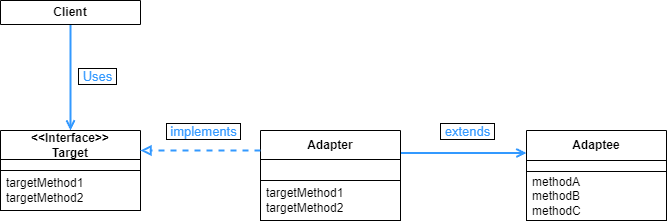
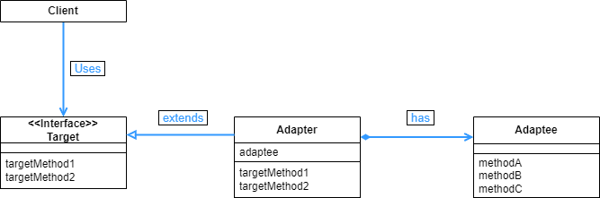

## Adapter 패턴

- 무엇인가를 포장해서 다른 용도로 사용할 수 있도록 변환해 주는 것을 Wrapper 라고 하는데, 이것과 같은 의미로 쓰이는 것이 Adapter 이다. (Wrapper 클래스가 원시 타입들을 객체 타입으로 바꿔주는 것도 같은 의미이다.)
- Adaptor 패턴에는 클래스에 의한 Adapter 패턴(상속 사용)과 인스턴스에 의한 Adapter 패턴(위임 사용)이 있다.

<br>

<div align="center">
  
</div>

<br>

Adapter 패턴을 구현하는 예시 UML 이다. 여기서 Banner 는 먼저 제공된 것, PrintBanner 는 어뎁터, Print 는 어뎁터를 통해서 변환되어서 최종적으로 얻고자하는 부분이다.

컴퓨터를 키기 위해서 220V 전원에다가 어뎁터가 달려있는 파워선을 연결해서 컴퓨터에는 12V 로 받아온다고 해보자. 이 때 220V 가 Banner, 어뎁터는 PrintBanner, 12V 는 Print 라고 보면 된다.

<br>

```java
public class Banner {
    private String string;

    public Banner(String string) {
        this.string = string;
    }

    public void showWithParen() {
        System.out.println("(" + string + ")");
    }

    public void showWithAster() {
        System.out.println("*" + string + "*");
    }
}
```

<br>

우선 Banner 클래스를 만든다. 이 클래스는 PrintBanner 를 통해서 Print 에 변환된 값으로 구현되게 된다.

<br>

```java
public interface Print {
    public void printWeak();
    public void printStrong();
}
```
<br>

Main 함수에서 전달 되어서 실행될 인터페이스 이다. 각 메소드는 어뎁터 부분에서 구현된다.

<br>

```java
public class PrintBanner extends Banner implements Print {
    public PrintBanner(String string) {
        super(string);
    }

    @Override
    public void printWeak() {
        showWithParen();
    }

    @Override
    public void printStrong() {
        showWithAster();
    }
}
```

어뎁터인 PrintBanner 는 Banner 와 Print 를 이어준다.  Banner 는 상속을, Print 는 구현을 한다. 앞서 클래스에 의한 Adapter 패턴과 인스턴스에 의한 Adapter 패턴 두 가지가 있다고 했는데, 이 경우는 상속을 했으므로 클래스에 의한 Adapter 패턴이다.

<br>

<div align="center">
  
</div>

<br>

위의 UML 은 상속이 아닌 인스턴스를 사용하는 방법이다. Print 를 인터페이스가 아니라 추상클래스로 만들어서 PrintBanner 에서 상속을 받고, PrintBanner 에서는 Banner 를 필드에서 호출한다.

<br>

```java
public abstract class Print2 {
    public abstract void printWeak();
    public abstract void printStrong();
}
```
<br>

이번에는 Print2 를 PrintBanner2 에 상속시켜야 하므로 abstract 를 붙여주어야 한다.

<br>

```java
public class PrintBanner2 extends Print2 {
    private Banner banner;

    public PrintBanner2(String string) {
        this.banner = new Banner(string);
    }

    @Override
    public void printWeak() {
        banner.showWithParen();
    }

    @Override
    public void printStrong() {
        banner.showWithAster();
    }
}
```
<br>

앞서 말했듯 Banner 를 필드를 통해서 호출한다. Banner 를 상속하는 경우에는 Banner 의 메소드를 그냥 사용했다면, 이번에는 필드를 통해서 호출한 banner 에서 메소드를 받아오면 된다.

<br>

```java
public class Main {

    public static void main(String[] args) {
        Print p = new PrintBanner("Hello1");
        p.printWeak();
        p.printStrong();

        System.out.println();

        Print2 p2 = new PrintBanner2("Hello2");
        p2.printWeak();
        p2.printStrong();
    }
}
============================================
(Hello1)
*Hello1*

(Hello2)
*Hello2*
```
<br>

Main 함수에서 Print, Print2 타입으로 선언된 뒤 할당받은 p, p2 를 각각의 메소드로 실행해보면 같은 결과를 출력하는 것을 볼 수 있다.

Main 함수에서는 Banner 클래스와 그 내부의 메소드는 전혀 적혀있지 않다. 그저 PrintBanner 라는 어뎁터를 통해 Main 함수에서 실행될 뿐이다.


<br>

<div align="center">
  
</div>

<br>

<div align="center">
  
</div>

<br>

앞서 살펴본 예시를 일반화 하면 다음과 같다. Adaptee 를 Adapter 를 통해 바꾸어서 Target 으로 전달하고, 그걸 Client 가 이용하는 걸로 보면 된다.

Adaptor 패턴은 기존에 클래스가 이미 존재할 때, 필요한 메소드들을 빠르게 만들어 볼 수 있다. 게다가 기존의 클래스를 삭제하지 않아도 되고, 버그가 발생하는 경우에도 기존 클래스에는 버그가 없는 것을 알고 있으므로 Adapter 부분을 중심으로 살펴보면 된다.

또한 만약 새로운 인터페이스를 만드는 경우, 기존의 클래스를 수정하기 보다는 adapter 를 만들어서 그 adapter 안에서 구현하면된다. 이러면 기존의 클래스가 만약 테스트 코드가 있다면 그 테스트 코드들은 전혀 수정할 필요가 없어진다.

다만 새로운 인터페이스와 기존의 클래스가 너무 다르다면 adapter 로도 연결 해줄수가 없다. 전기를 가스로 바꿀 수는 없는 것처럼 말이다.

상속과 위임 두가지 방법을 살펴보았는데, 위임을 사용하는 편이 문제가 발생할 확률이 적다. 상속을 하는 경우에는 그 상위 클래스의 내부 동작을 잘 알지 못하면 상속을 효과적으로 사용하기 어렵기 때문이다.

소프트웨어는 자주 버전업 상황이 필요한데, Adapter 패턴을 사용하면 이전 버전과 최신 버전을 공존 시키면서 유지보수까지 편리한 상황을 만들 수도 있다.