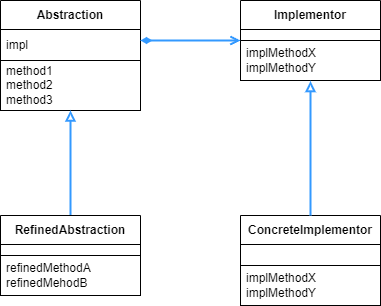

## Bridge 패턴

- 추상-구현 관계를 가지는 구현 클래스 계층과, 하위 클래스에서 새로운 기능을 추가하는 기능의클래스 계층을 서로 이어주는 패턴이다.

<br>

<div align="center">
 
</div>

<br>

DisPlayImpl 쪽을 보면 지금까지의 디자인 패턴들과 같이 추상 - 구현 관계를 가지고 있다. 하지만 왼쪽의 Display, CountDisplay 의 경우 CountDisplay 가 무언가를 구체화 시키는 것이 아니라, 새로운 기능을 추가하고 있다.

<br>

```java
public class Display {
    private DisplayImpl impl;

    public Display(DisplayImpl impl) {
        this.impl = impl;
    }

    public void open() {
        impl.rawOpen();
    }

    public void print() {
        impl.rawPrint();
    }

    public void close() {
        impl.rawClose();
    }

    public final void display() {
        open();
        print();
        close();
    }
}
```

<br>

우선 Display 클래스 부터 보면, 클래스 다이어그램에서 DisplayImpl 과 이어져 있는데, 이를 코드에서는 DisplayImpl 의 메소드를 호출하는 방식으로 연결했다. 만약 DisplayImp 가 Display 를 상속 받아서 구현하는 관계였다면, 구현하는 클래스들을 확장하기가 어렵다. 이렇게 위임으로 넘겨 버리고 DisplayImpl 을 추상클래스나 인터페이스로 만들어버리면 관리도 편하고 알아보기도 편하다.

<br>

```java
public class CountDisplay extends Display {

    public CountDisplay(DisplayImpl impl) {
        super(impl);
    }

    public void multiDisplay(int times) {
        open();
        for (int i = 0; i < times; i++) {
            print();
        }
        close();
    }
}
```

<br>

CountDisplay 가 Display 를 상속받았지만, Display 클래스는 추상 클래스가 아니다. 따라서 무언가를 구체화할 필요가 없다. 대신에 multiDisplay 라는 메소드로 새로운 기능을 추가한 것을 볼 수 있다.

<br>

```java
public abstract class DisplayImpl {
    public abstract void rawOpen();
    public abstract void rawPrint();
    public abstract void rawClose();
}
```

<br>

DisplayImpl 은 지금까지 봐왔던 추상-구현 관계에서 추상 부분을 담당하므로 추상클래스로 만들었다.

<br>

```java
public class StringDisplayImpl extends DisplayImpl {
    private String string;
    private int width;

    public StringDisplayImpl(String string) {
        this.string = string;
        this.width = string.length();
    }

    @Override
    public void rawOpen() {
        printLine();
    }

    @Override
    public void rawPrint() {
        System.out.println("|" + string + "|");
    }

    @Override
    public void rawClose() {
        printLine();
    }

    public void printLine() {
        System.out.print("+");
        for (int i = 0; i < width; i++) {
            System.out.print("-");
        }
        System.out.println("+");
    }
}
```

<br>

추상-구현 관계에서 구현쪽에 해당하므로, 추상클래스를 상속받고 메소드를 구체화 했다.

<br>

```java
public class Main {

    public static void main(String[] args) {
        Display d1 = new Display(new StringDisplayImpl("Hello"));
        Display d2 = new CountDisplay(new StringDisplayImpl("Hello, world"));
        CountDisplay d3 = new CountDisplay(new StringDisplayImpl("Hello, people"));
        d1.display();
        d2.display();
        d3.display();
        d3.multiDisplay(5);
    }
}
===================================================================================
+-----+
|Hello|
+-----+
+------------+
|Hello, world|
+------------+
+-------------+
|Hello, people|
+-------------+
+-------------+
|Hello, people|
|Hello, people|
|Hello, people|
|Hello, people|
|Hello, people|
+-------------+
```

<br>

Main 함수의 실행결과이다. d2 의 경우는 CountDisplay 로 인스턴스를 생성했는데, 이는 CountDisplay 가 Display 를 상속하고 있기 때문에 가능하다.

다만 d3.multiDisplay() 처럼 새로 추가한 기능을 사용하기 위해서는 Display 타입이 아닌 CountDisplay 타입이어야 한다.

<br>

<div align="center">
 
</div>

<br>

앞서 살펴본 것 처럼 기능의 계층 클래스, 구현의 계층 클래스로 2가지의 계층 클래스가 있고 그 2가지가 연결된 패턴이 Bridge 패턴이다.

이렇게 두개로 나누는 이유는, 확장이 편해지기 때문이다. 서로 방해받지 않으면서 한쪽에서는 추가 기능을, 한쪽에서는 추가 구현을 할 수가 있다. 그럼에도 추가된 기능을 모든 구현 클래스에서 사용할 수가 있다.

앞서 본 예시에서 Display 와 DisplayImpl 을 연결할 때 상속이 아닌 생성자 주입을 사용했다. 그리고 Display 의 메소드에서는 실행시에 DisplayImpl에 있는 메소드를 실행하게 하므로써 일종의 “위임” 을 했다. 이렇게 하면 연결은 되어있지만, 약한 연결 관계를 형성해서 코드 확장시 제약없이 훨씬 편하게 확장할 수 있다.

만약 상속으로 두개의 클래스가 연결되어 있다면, 추상-구현 부분의 확장을 하기가 꽤나 복잡해진다. 이미 DisplayImpl 부분에서 구체화를 해야하므로, 여길 또 추상으로 넘기는 것은 알아보기가 불편해진다. implementation 이라고 되어있어서 타고 갔는데, 또 implementation 이라고 뜨면 분명 불편할 것이다. Bridge 패턴처럼 해놓으면 추상-구현 부분을 알아보기도 쉽고, 확장도 훨씬 편하다.