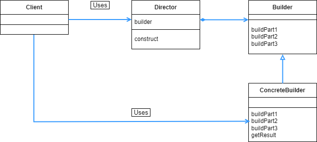

## Builder 패턴

- 인스턴스를 생성시에 좀 더 구조적인 단계를 거쳐서 생성하도록 하는 패턴이다.

<br>

<div align="center">
 
</div>

<br>

클래스 다이어그램을 보면 일단 Prototype 패턴에서 Main 클래스 부분이 왼쪽에 추가 되고, 그 Main 클래스가 이번에는 하위 클래스들을 사용해야하는 것을 볼 수 있다. 이러한 점 때문에 좀 더 단계를 밟지만, Main 클래스에서는 여러가지 클래스를 사용해서 작성해야한다는 단점이 있다.

<br>

```java
public abstract class Builder {
    abstract void makeTitle(String title);
    abstract void makeString(String str);
    abstract void makeItems(String[] items);
    abstract void close();
}

```

<br>

이번 예시는 Builder 클래스에 따라서 문서를 만들 예정이므로, Builder 클래스에는 문서를 만드는 추상 메소드를 작성한다.

<br>

```java
public class Director {
    private Builder builder;

    public Director(Builder builder) {
        this.builder = builder;
    }

    public void construct() {
        builder.makeTitle("Greeting");
        builder.makeString("일반적인 인사");
        builder.makeItems(new String[] {"How are you?", "Hello", "Hi"});
        builder.makeString("시간대별 인사");
        builder.makeItems(new String[] {"Good morning", "Good afternoon", "Good evening"});
        builder.close();
    }

```

<br>

Director 는 Builder 를 이용해서 문서를 만든다. Director 는 Builder 에게 무엇을 가지고 만들지 재료를 주는 클래스라고 보면되는데, Director 는 Builder 만을 사용하고 하위 클래스는 작성하지 않는다. 즉 하위 클래스에는 의존하지 않는다는 것을 알 수 있다.

그렇게 하위 클래스에는 의존하지 않고 Builder 에만 의존을 하면서, Builder를 호출했을 때 그 구체적인 방법을 전달 해주는 과정을 의존성 주입이라고 한다. 위의 예시에서 이를 구현하기 위해서 Director 의 생성자 파라미터에 Builder 가 들어가 있는 것을 볼 수 있다. 이렇게 의존성 주입을 구현한 것을 생성자 주입이라고 하는 것이다.

<br>

```java
public class TextBuilder extends Builder {
    private StringBuilder sb = new StringBuilder();

    @Override
    void makeTitle(String title) {
        sb.append("==========================\n");
        sb.append("[");
        sb.append("title");
        sb.append("]\n\n");
    }

    @Override
    void makeString(String str) {
        sb.append("■");
        sb.append(str);
        sb.append("\n\n");
    }

    @Override
    void makeItems(String[] items) {
        for (String s : items) {
            sb.append(".");
            sb.append(s);
            sb.append("\n");
        }
        sb.append("\n");
    }

    @Override
    void close() {
        sb.append("==========================\n");
    }

    public String getTextResult() {
        return sb.toString();
    }
}
```

<br>

Tamplate Method, Factory Method, Prototype 등에서 계속 봤던 추상클래스를 구체화 하는 하위 클래스 부분이다.

<br>

```java
public class HTMLBuilder extends Builder{
    private String filename = "untitled.html";
    private StringBuilder sb = new StringBuilder();

    @Override
    void makeTitle(String title) {
        filename = title + ".html";
        sb.append("<!DOCTYPE html>\n");
        sb.append("<html>\n");
        sb.append("<head><title>");
        sb.append(title);
        sb.append("</title></head>\n");
        sb.append("<body>\n");
        sb.append("<h1>");
        sb.append(title);
        sb.append("</h1>\n\n");
    }

    @Override
    void makeString(String str) {
        sb.append("<p>");
        sb.append(str);
        sb.append("</p>\n\n");
    }

    @Override
    void makeItems(String[] items) {
        sb.append("<ul>\n");
        for (String s : items) {
            sb.append("<li>");
            sb.append(s);
            sb.append("</li>\n");
        }
        sb.append("</ul>\n\n");
    }

    @Override
    void close() {
        sb.append("</body>");
        sb.append("</html>\n");
        try {
            Writer writer = new FileWriter(filename);
            writer.write(sb.toString());
            writer.close();
        } catch (IOException e) {
            e.printStackTrace();
        }
    }

    public String getHTMLResult() {
        return filename;
    }
}
```

<br>

TextBuilder 와 같은 기능을 하는 Builder 를 상속받아서 구체화 시키는 하위 클래스이다.

<br>

```java
public class Main {

    public static void main(String[] args) {
        if (args.length != 1) {
            usage();
            System.exit(0);
        }
        if(args[0].equals("text")) {
            TextBuilder textBuilder = new TextBuilder();
            Director director = new Director(textBuilder);
            director.construct();
            String result = textBuilder.getTextResult();
            System.out.println(result);
        } else if (args[0].equals("html")) {
            HTMLBuilder htmlBuilder = new HTMLBuilder();
            Director director = new Director(htmlBuilder);
            director.construct();
            String filename = htmlBuilder.getHTMLResult();
            System.out.println("HTML 파일 " + filename + "이 작성되었습니다.");
        } else {
            usage();
            System.exit(0);
        }
    }

    public static void usage() {
        System.out.println("Usage: java Main text / 텍스트로 문서 작성");
        System.out.println("Usage: java Main html / HTML 파일로 문서 작성");
    }
}
```

<br>

이제 Main 에서 본격적으로 문서를 만드는 작업을 수행한다. Main 은 Director 를 사용해서 문서를 만드는데, 이전 디자인 패턴들과는 다르게 하위 클래스들을 직접 Main 함수에서 호출해야한다. 하위 클래스에서 구현을 담당해서 유지보수를 좋게 하는 점이 추상과 구현을 나눈 장점이었는데, Builder 패턴에서는 그 의미가 약간 없어지는 점이 있다.

<br>

```java
==========================
[title]

■일반적인 인사

.How are you?
.Hello
.Hi

■시간대별 인사

.Good morning
.Good afternoon
.Good evening

==========================
```

<br>

실행시 String[] args 에다가 변수를 넣어주어서 실행결과를 가지고 왔다. 위의 경우는 args[0] 이 “text” 인 경우이다. StringBuilder 를 사용해서 그 결과를 콘솔창에 보여준다.

<br>

```java
<!DOCTYPE html>
<html>
<head><title>Greeting</title></head>
<body>
<h1>Greeting</h1>

<p>일반적인 인사</p>

<ul>
<li>How are you?</li>
<li>Hello</li>
<li>Hi</li>
</ul>

<p>시간대별 인사</p>

<ul>
<li>Good morning</li>
<li>Good afternoon</li>
<li>Good evening</li>
</ul>

</body></html>

```

<br>

args[0] 가 “html” 인 경우에는 파일을 생성하게 했으므로, 위와 같은 html 파일이 생성됨을 확인할 수 있다.

<br>

<div align="center">
 
</div>

<br>

Builder 라는 추상 클래스가 있고, 이를 구현하는 ConcreteBuilder 가 있으며 Director 가 Builder 만을 사용하는 과정에서 의존성 주입이 일어난다는 것이 Builder 패턴의 특징이다.

(Gof 책에서는 Builder 패턴에서 Client 부분을 포함시키지 않는다.)