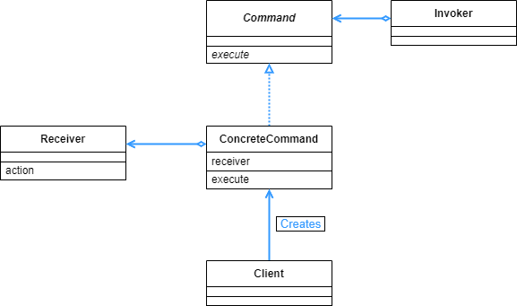

## Command 패턴

- 명령을 클래스로 만들어서 사용한다.

<br>

<div align="center">
 
</div>

<br>

GUI 환경에서 이벤트가 자주 발생하는데, 그런 이벤트 또한 명령의 일종이다. 그런 점을 착안해서 이번 예시는 awt 프레임워크의 canvas 에 그림을 그리는 것을 구현한다.

Main 에서 명령 인스턴스를 생성해서, 그 인스턴스를 활용하는 것으로 이벤트를 발생시킨다.

<br>

```java
public interface Command {
    public abstract void execute();
}
```

<br>

명령 인터페이스이다. 명령을 실행하는 execute() 메소드를 추상화 한다.

<br>

```java
public class MacroCommand implements Command {
    private Deque<Command> commands = new ArrayDeque<>();

    @Override
    public void execute() {
        for (Command cmd : commands) {
            cmd.execute();
        }
    }

    public void append(Command cmd) {
        if (cmd == this) {
            throw new IllegalArgumentException("infinite loop caused by append");
        }
        commands.push(cmd);
    }

    public void undo() {
        if (!commands.isEmpty()) {
            commands.pop();
        }
    }

    public void clear() {
        commands.clear();
    }
}
```

<br>

명령의 집합을 나타내는 클래스이다. execute() 메소드를 보면 반복문을 돌면서 그동안 모아놓았던 모든 명령을 실행한다.

이번 예시에서는 DrawCommand 라는 클래스 1개 밖에 없지만, 더 Command 클래스가 많아지는 경우 이 클래스의 메소드를 통해서 각 종류의 명령들을 모두 실행할 수 있다.

<br>

```java
public class DrawCommand implements Command {
    protected Drawable drawable;

    private Point position;

    public DrawCommand(Drawable drawable, Point position) {
        this.drawable = drawable;
        this.position = position;
    }

    @Override
    public void execute() {
        drawable.draw(position.x, position.y);
    }
}
```

<br>

그림을 그리는 명령을 내리는 클래스이다. drawable 인터페이스의 메소드를 호출하는 것으로 그림 그리는 명령을 내린다.

<br>

```java
public interface Drawable {
    public abstract void draw(int x, int y);
}
```

<br>

DrawCommand 에서 호출하는 인터페이스이다.

<br>

```java
public class DrawCanvas extends Canvas implements Drawable {
    private Color color = Color.black;
    private int radius = 6;
    private MacroCommand history;

    public DrawCanvas(int width, int height, MacroCommand history) {
        setSize(width, height);
        setBackground(Color.white);
        this.history = history;
    }

    @Override
    public void paint(Graphics g) {
        history.execute();
    }

    @Override
    public void draw(int x, int y) {
        Graphics g = getGraphics();
        g.setColor(color);
        g.fillOval(x - radius, y - radius, radius * 2, radius * 2);
    }
}
```

<br>

Canvas 를 상속해서 awt 프레임워크에 그림을 그리는 동작을 구체화 하였다.

<br>

```java
public class Main extends JFrame implements MouseMotionListener, WindowListener {

    private MacroCommand history = new MacroCommand();
    private DrawCanvas canvas = new DrawCanvas(400, 400, history);
    private JButton clearButton = new JButton("clear");

    public Main(String title) {
        super(title);

        this.addWindowListener(this);
        canvas.addMouseMotionListener(this);
        clearButton.addActionListener(e -> {
            history.clear();
            canvas.repaint();
        });

        Box buttonBox = new Box(BoxLayout.X_AXIS);
        buttonBox.add(clearButton);
        Box mainBox = new Box(BoxLayout.Y_AXIS);
        mainBox.add(buttonBox);
        mainBox.add(canvas);
        getContentPane().add(mainBox);

        pack();
        setVisible(true);
    }

    public static void main(String[] args) {
        new Main("Command Pattern Sample");
    }

    @Override
    public void mouseDragged(MouseEvent e) {
        Command cmd = new DrawCommand(canvas, e.getPoint());
        history.append(cmd);
        cmd.execute();
    }

    @Override
    public void windowClosing(WindowEvent e) {
        System.exit(0);
    }

    @Override
    public void mouseMoved(MouseEvent e) {}

    @Override
    public void windowOpened(WindowEvent e) {}

    @Override
    public void windowClosed(WindowEvent e) {}

    @Override
    public void windowIconified(WindowEvent e) {}

    @Override
    public void windowDeiconified(WindowEvent e) {}

    @Override
    public void windowActivated(WindowEvent e) {}

    @Override
    public void windowDeactivated(WindowEvent e) {}
}
```

<br>

mouseDragged 메소드를 보면 마우스 동작에 따라서 명령을 MacroCommand 에 저장하고, 그걸 구체화한 명령 클래스의 실행 메소드에 따라서 명령을 실행한다. 그러면 그 명령에 해당하는 동작을 프로그램이 실행하게 된다.

<br>

<div align="center">
 
</div>

<br>

마우스의 드래그에 따라서 그림을 그리는 명령을 받게 되므로, 위와 같은 동작을 확인할 수 있다.

<br>

<div align="center">
 
</div>

<br>

위의 예시에서는 Main 함수에서 Client 와 invoker 부분을 모두 담당했다. Invoker 는 명령 실행을 시작하는 부분이고, Client 는 명령을 Receiver 에게 할당하는 부분인데 두 가지를 모두 확인할 수 있다.

위의 예시에서는 Receiver 부분이 하나밖에 없었는데, 만약 Receiver 가 많은 경우 ConcreteCommand 에서 Receiver 에 대한 정보를 알고 있으므로 Client 에서 명령을 할당해 주기 용이하다. Client 는 여러개의 Receiver 에 대한 정보를 직접적으로 알지 못해도 되기 때문이다.