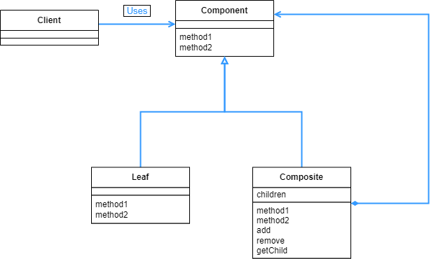

## Composite 패턴

- 어떤 내용물이 있고 그 내용물을 담는 그릇이 있다면, 내용물과 그릇을 동일시 해서 재귀적인 구조를 만드는 패턴이다. 가장 쉽게 볼 수 있는 예시로 컴퓨터의 디렉토리 구조이다.

<br>

<div align="center">
 
</div>

<br>

Template Method 패턴 처럼 추상-구체화 구조가 있기는 한데, 하위 클래스에서 상위클래스의 인스턴스를 이용하는 집약구조를 볼 수 있다. 이러한 구조로 재귀구조를 만들어낸다.

컴퓨터의 폴더, 즉 디렉토리 구조를 보면 디렉토리안에 파일이 있는 경우도 있지만 또 디렉토리가 있는 경우도 있다. 디렉토리안에 디렉토리가 있는 구조를 만들기 위해서 위와 같은 클래스 다이어그램이 만들어진 것이다.

<br>

```java
public abstract class Entry {
    public abstract String getName();

    public abstract int getSize();

    public void printList() {
        printList("");
    }

    protected abstract void printList(String prefix);

    @Override
    public String toString() {
        return getName() + "(" + getSize() + ")";
    }
}
```

<br>

우선 추상을 담당하는 추상클래스 부분이다. printList 란 이름을 가진 메소드를 2개를 만들었는데, 파라미터를 다르게 한 오버로딩을 사용했다. 여기서 printList(String prefix) 는 protected 로 선언해서 상속받은 하위 클래스에서만 사용하게 했다.

<br>

```java
public class File extends Entry {
    private String name;
    private int size;

    public File(String name, int size) {
        this.name = name;
        this.size = size;
    }

    @Override
    public String getName() {
        return name;
    }

    @Override
    public int getSize() {
        return size;
    }

    @Override
    protected void printList(String prefix) {
        System.out.println(prefix + "/" + this);
    }
}
```

<br>

Entry 를 상속받은 file 클래스로, 이름과 사이즈를 가지고 오는 get 메소드와 파일명을 출력하는 printList 로 이루어져있다.

<br>

```java
public class Directory extends Entry {
    private String name;
    private List<Entry> directory = new ArrayList<>();

    public Directory(String name) {
        this.name = name;
    }

    @Override
    public String getName() {
        return name;
    }

    @Override
    public int getSize() {
        int size = 0;
        for (Entry entry : directory) {
            size += entry.getSize();
        }
        return size;
    }

    @Override
    protected void printList(String prefix) {
        System.out.println(prefix + "/" + this);
        for (Entry entry : directory) {
            entry.printList(prefix + "/" + name);
        }
    }

    public Entry add(Entry entry) {
        directory.add(entry);
        return this;
    }
}
```

<br>

앞서 말했듯 디렉토리안에 또 디렉토리가 있는 구조를 만들어야하기 때문에, add 메소드에서 볼 수 있듯이 파라미터로 Entry 타입의 변수를 받는다. 여기서 Entry 클래스를 바로 받아서 추가되는 요소가 파일인지, 디렉토리인지 확인하지 않고 일단 추가를 한다.

디렉토리의 getSize 메소드를 보면 파일 처럼 간단하지가 않다. 그 이유는 디렉토리에는 계속해서 다른 디렉토리나 파일이 추가될 수 있으므로, 그 파일/디렉토리의 크기들을 다 더해야하기 때문이다. entry.getSize() 로 size 에다가 더하는데, 파일이면 그냥 파일의 크기를 가지고 오고, 디렉토리라면 이렇게 하위 파일/디렉토리의 크기를 더하는 getSize() 메소드를 재귀적으로 호출한다.

이렇게 파일이나 디렉토리인 경우에 같은 메소드인 getSize() 로 크기를 얻을 수 있는 이유가 바로 Composite 패턴의 특징인 “그릇과 내용물을 동일시 한다.” 라는 점을 이용하기 때문이다.

<br>

```java
public class Main {
    public static void main(String[] args) {
        System.out.println("Making root entries...");
        Directory rootdir = new Directory("root");
        Directory bindir = new Directory("bin");
        Directory tmpdir = new Directory("tmp");
        Directory usrdir = new Directory("usr");

        rootdir.add(bindir);
        rootdir.add(tmpdir);
        rootdir.add(usrdir);
        bindir.add(new File("vi", 10000));
        bindir.add(new File("latex", 20000));
        rootdir.printList();
        System.out.println();

        System.out.println("Making user entries...");
        Directory kim = new Directory("kim");
        Directory lee = new Directory("lee");
        Directory choi = new Directory("choi");

        usrdir.add(kim);
        usrdir.add(lee);
        usrdir.add(choi);
        kim.add(new File("diary.html", 100));
        kim.add(new File("Composite.java", 200));
        lee.add(new File("memo.tex", 300));
        choi.add(new File("game.doc", 400));
        choi.add(new File("junk.mail", 500));
        rootdir.printList();
    }
}
============================================================
Making root entries...
/root(30000)
/root/bin(30000)
/root/bin/vi(10000)
/root/bin/latex(20000)
/root/tmp(0)
/root/usr(0)

Making user entries...
/root(31500)
/root/bin(30000)
/root/bin/vi(10000)
/root/bin/latex(20000)
/root/tmp(0)
/root/usr(1500)
/root/usr/kim(300)
/root/usr/kim/diary.html(100)
/root/usr/kim/Composite.java(200)
/root/usr/lee(300)
/root/usr/lee/memo.tex(300)
/root/usr/choi(900)
/root/usr/choi/game.doc(400)
/root/usr/choi/junk.mail(500)
```

<br>

new Directory 로 디렉토리를 만들고, add 메소드를 통해서 하위에 파일이나 디렉토리를 추가한다. 그 후 roodir.printList() 를 통해서 전체 디렉토리 구조를 쭉 출력한다.

<br>

<div align="center">
 
</div>

<br>

이렇게 재귀구조를 만들 수 있는 이유는, 앞서 계속 언급했듯이 그릇과 내용물을 동일시 하기 때문이다. 여기서 말하는 동일시는, 그릇에서 어떠한 작업이 이루어지면 내용물에서도 같은 작업을 할 수 있다. 위의 클래스 다이어그램에서도 Component 에서 이루어진 작업을 Leaf 에서도, Compostie 에서도 할 수 있다. method1, method2 가 3군데 모두 있어서 하나의 메소드를 각 영역에서 전부 적용해서 사용할 수 있다는 점이 Composite 패턴의 특징이다.

또한 이렇게 동일시 하므로, 개별 속성들을 하나의 집합으로 묶을수도 있다. 디렉토리 구조만 생각해봐도 파일과 디렉토리가 있고, 그 파일과 디렉토리를 가지고 있는 상위 디렉토리가 있는데, 상위 디렉토리와 그 디렉토리 하위의 파일과 디렉토리가 동일시 된다. 파일/디렉토리 이름 조회, 크기 조회, 위치 출력등 같은 작업을 할 수 있기 때문이다.

이런 특성을 이용해서 어떤 프로그램의 동작 테스트를 하나로 묶는 과정도 구현할 수 있다. 처음에 ui/네트워크/서버 입력 테스트를 각각 만들고 이를 Input 테스트라고 만들고, 출력 테스트도 각각 만들어서 Output 테스트라고 만들 수 있다. 또한 이를 묶어서 I/O 테스트로 더 큰 그룹으로 만들 수 있다. 이렇게 Composite 패턴을 이용해서 만들면 각 그룹이나 하위 그룹, 하위 개별 테스트에서 똑같은 이름을 가진 메소드를 실행할 수 있다. 이런 특성을 복수와 단수의 동일시라고 부르기도 한다.

위의 예시에서는 Directory 클래스에서 add 메소드를 활용해서 자식 요소를 추가하는 것을 구현했다.  이는 설계하기에 따라서 자식요소를 관리하는 부분을 Composite 부분이 아닌 Component 부분에다가 넣을 수도 있다. 하지만 이 경우에는 Leaf 부분에서 자식을 조작하는 요청이 발생하는 경우에는 에러 처리가 필요하다. 자식 요소를 관리하는 부분을 설계시 잘 고려해서 추가해야한다.