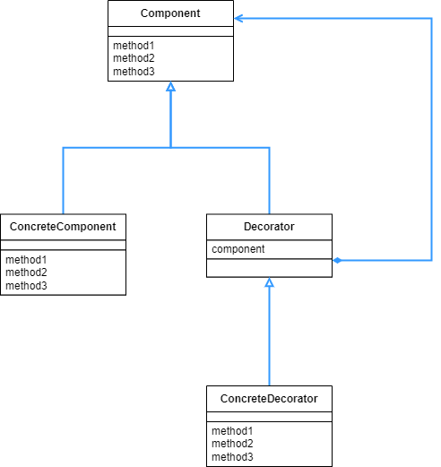

## Decorator 패턴

- composite 패턴이 내용물과 그 내용물을 담는 그릇을 동일시 했다면, decorator 패턴은 그 그릇을 추상화 한다.

<br>

<div align="center">
 
</div>

<br>

Composite 패턴의 클래스 다이어그램과 매우 유사한데, 다른 점은 동일시 하는 대상이 추상화가 되어서 그 추상클래스나 인터페이스를 상속/구체화 하는 하위클래스가 생겼다는 것이다.

composite 에서는 내용물과 그 내용물을 담는 그릇을 동일시 한다고 했다. decorator 는 그 그릇을 추상화 하는 것이므로, 조금 예시를 바꾸어서 내용물과 그 내용물을 넣는 장식틀을 동일시 한다고 하는 편이 이해하기 좋다. 그럼 그 장식틀을 각기 다른 형태로 꾸민다고 보면 되는것이다.

이번 예시도 내용물과 장식틀을 일치시킨다는 개념을 토대로 어떤 문자열과, 그 문자열을 담는 장식틀인 Border 를 만들었다. Border 는 또 하위 클래스에 따라서 각기 다른 형태로 꾸며진다. 또한 그 꾸민걸 다시 재귀적으로 꾸밀 수 있다.

<br>

```java
public abstract class Display {
    public abstract int getColumns();
    public abstract int getRows();
    public abstract String getRowText(int row);

    public void show() {
        for (int i = 0; i < getRows(); i++) {
            System.out.println(getRowText(i));
        }
    }
}
```

<br>

우선 내용물에 해당하는 부분을 작성한다. 화면에 무언가 출력하는 메소드를 만든 후, 구체적으로 뭘 보여줄 지는 하위클래스에서 구체화한다.

<br>

```java
public class StringDisplay extends Display {
    private String string;

    public StringDisplay(String string) {
        this.string = string;
    }

    @Override
    public int getColumns() {
        return string.length();
    }

    @Override
    public int getRows() {
        return 1;
    }

    @Override
    public String getRowText(int row) {
        if (row != 0) {
            throw new IndexOutOfBoundsException();
        }
        return string;
    }
}
```

<br>

Display 를 상속받은 하위 클래스로, 문자열 한줄을 출력하는 내용을 담을 클래스이다. 내용물에 해당된다고 보면 된다.

<br>

```java
public abstract class Border extends Display {
    protected Display display;

    public Border(Display display) {
        this.display = display;
    }
}
```

<br>

Display 를 상속 받은 또 다른 클래스로, 내용물이 아닌 앞서 말한 장식틀에 해당하는 추상클래스이다. 상속받은 클래스를 생성자 주입으로 다시 연결하는 것을 볼 수 있다.

<br>

```java
public class SideBorder extends Border {
    private char borderChar;

    public SideBorder(Display display, char ch) {
        super(display);
        this.borderChar = ch;
    }

    @Override
    public int getColumns() {
        return 1 + display.getColumns() + 1;
    }

    @Override
    public int getRows() {
        return display.getRows();
    }

    @Override
    public String getRowText(int row) {
        return borderChar + display.getRowText(row) + borderChar;
    }
}
```

<br>

장식틀을 또 어떻게 꾸밀지에 해당하는 하위클래스 중 하나이다. 여기서는 양 끝에 특정한 문자열을 붙이는 것으로 장식한다.

<br>

```java
public class FullBorder extends Border {

    public FullBorder(Display display) {
        super(display);
    }

    @Override
    public int getColumns() {
        return 1 + display.getColumns() + 1;
    }

    @Override
    public int getRows() {
        return 1 + display.getRows() + 1;
    }

    @Override
    public String getRowText(int row) {
        if (row == 0) {
            return "+" + makeLine('-', display.getColumns()) + "+";
        } else if (row == display.getRows() + 1) {
            return "+" + makeLine('-', display.getColumns()) + "+";
        } else {
            return "|" + display.getRowText(row - 1) + "|";
        }
    }

    private String makeLine(char ch, int count) {
        StringBuilder line = new StringBuilder();
        for (int i = 0; i < count; i++) {
            line.append(ch);
        }
        return line.toString();
    }
}
```

<br>

이 하위 클래스의 경우에는 문자열을 중심으로 ㅁ 모양으로 +, | , - 문자열을 이용해서 감싼다.

<br>

```java
public class Main {

    public static void main(String[] args) {
        Display b1 = new StringDisplay("Hello, World!");
        Display b2 = new SideBorder(b1, '#');
        Display b3 = new FullBorder(b2);
        
        b1.show();
        System.out.println();
        
        b2.show();
        System.out.println();
        
        b3.show();
        System.out.println();
        
        Display b4 = new SideBorder(
            new FullBorder(
                new FullBorder(
                    new SideBorder(
                        new FullBorder(
                            new StringDisplay("Hello, World!!")
                        ), '*'
                    )
                )
            ), '/'
        );
        b4.show();
    }
}
======================================================================
Hello, World!

#Hello, World!#

+---------------+
|#Hello, World!#|
+---------------+

/+--------------------+/
/|+------------------+|/
/||*+--------------+*||/
/||*|Hello, World!!|*||/
/||*+--------------+*||/
/|+------------------+|/
/+--------------------+/
```

<br>

Main 함수의 내부와 실행결과를 보면 알 수 있듯이 계속해서 재귀적인 구조로 하나의 문자열이 꾸며지는 것을 볼 수 있다.

<br>

<div align="center">
 
</div>

<br>

Composite 패턴과 매우 유사하지만, Derorator 패턴의 경우 목적이 좀 다르다. 위의 Main 함수에서도 볼 수 있듯이 Decorator 패턴의 경우 장식틀이 하나로 고정된 것이 아니라 다양하게 변화하면서 기능이 추가된다. 계속해서 바깥에 테두리를 겹쳐 나가면서 기능이 추가된다고 보면 된다.

<br>

```java
Reader reader = new LineNumberReader(
										new BufferedReader(
													new FileReader("datafile.text")
												)
										);
```

<br>

위의 예시는 [java.io](http://java.io) 패키지에 포함된 클래스이다. 단순히 파일을 읽는 FileReader 에서 데이터를 읽을 때 버퍼링을 하는 BufferedReader, 행 번호를 관리하는 LineNumberReader 가 바깥쪽에 계속해서 추가되는 것을 볼 수 있다. 이렇게 Decorator 패턴을 사용하는 예시를 io 패키지에서 자주 볼 수 있다.

물론 자바에서는 이렇게 하면 가독성이 떨어지고 코드 작성에도 번거로우므로 nio 패키지에 여러 기능이 합쳐져 있는 메소드를 제공하기는 한다.