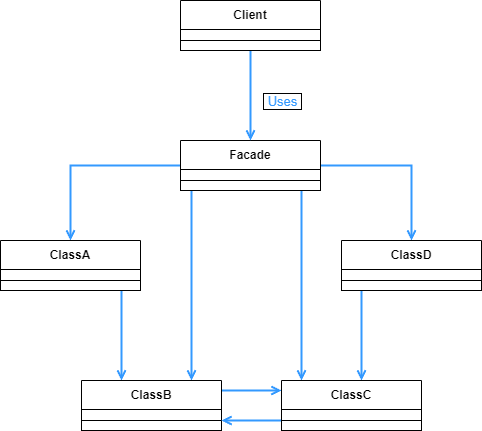

## Facade 패턴

- 내부의 복잡한 로직을 하나의 창구에서 처리할 수 있도록 해서 외부에서의 요청은 단순하게 할 수 있도록 만드는 패턴이다.

<br>

<div align="center">
 
</div>

<br>

앞서 말했듯이, Facade 패턴은 외부 요청을 처리하는 하나의 창구를 만든다. 이번 예시에서는 창구에는 사용할 수 있는 하나의 메소드만 있고, 외부에서 호출시에는 이 메소드만 호출하면 된다. 그 메소드에서는 앞의 창구와 연결된 클래스간의 로직이 전부 담겨있어서, 외부에서 이 로직들을 생각할 필요가 없다.

<br>

```java
public class Database {
    private Database() {
    }

    public static Properties getProperties(String dbname) throws IOException {
        String filename = dbname + ".txt";
        Properties prop = new Properties();
        prop.load(new FileReader(filename));
        return prop;
    }
}
```

<br>

창구와 연결된 내부 클래스 중 하나이다. 이번 예시는 txt 파일에서 데이터를 읽어서 페이지를 만들때 가져다가 쓰도록 했다.

<br>

```java
public class HtmlWriter {
    private Writer writer;

    public HtmlWriter(Writer writer) {
        this.writer = writer;
    }

    public void title(String title) throws IOException {
        writer.write("<!DOCTYPE html>");
        writer.write("<html>");
        writer.write("<head>");
        writer.write("<title>" + title + "</title>");
        writer.write("</head>");
        writer.write("<body>");
        writer.write("\n");
        writer.write("<h1>" + title + "</h1>");
        writer.write("\n");
    }

    public void paragraph(String msg) throws IOException {
        writer.write("<p>" + msg + "</p>");
        writer.write("\n");
    }

    public void link(String href, String caption) throws IOException {
        paragraph("<a href=\"" + href + "\">" + caption + "</a>");
    }

    public void mailto(String mailaddr, String username) throws IOException {
        link("malito:" + mailaddr, username);
    }

    public void close() throws IOException {
        writer.write("</body>");
        writer.write("</html>");
        writer.write("\n");
        writer.close();
    }
}
```

<br>

Database 클래스 에서 가지고 온 데이터를 합쳐서 페이지를 구체적으로 만들어주는 클래스이다.

<br>

```java
public class PageMaker {

    public PageMaker() {
    }

    public static void makeWelcomePage(String mailaddr, String filename) {
        try {
            Properties mailprop = Database.getProperties("maildata");
            String username = mailprop.getProperty(mailaddr);
            HtmlWriter writer = new HtmlWriter(new FileWriter(filename));
            writer.title(username + "'s web page");
            writer.paragraph("Welcome to " + username + "'s web page!");
            writer.paragraph("Nice to meet you!");
            writer.mailto(mailaddr, username);
            writer.close();
            System.out.println(filename + " is created for " + mailaddr + " (" + username + ")");
        } catch (IOException e) {
            e.printStackTrace();
        }
    }
}
```

<br>

창구를 맡은 클래스이다. 보면 메소드가 makeWelcomePage 하나밖에 없다. 물론 이 메소드의 규모가 좀 커지기는 했지만, 외부에서 호출하는 입장을 생각해 봤을 때는 앞서 만든  HtmlWriter 나 Database 클래스들을 전혀 신경 쓰지 않아도 된다. 그저 makeWelcomePage 메소드와 그에 따라 필요한 파라미터만 생각하면 된다.

<br>

```java
public class Main {
    public static void main(String[] args) {
        PageMaker.makeWelcomePage("test@example.com", "welcome.html");
    }
}
```

<br>

메인함수를 보면 그저 창구에 해당했던 PageMaker 만 호출 했다. 이렇게나 Main 클래스 쪽이 간단해진다.

<br>

```java
==maildata.txt==

test@example.com=Kim
```

<br>

<div align="center">
 
</div>

<br>

Main 클래스 실행시 위의 maildata.txt 파일의 정보를 가지고 와서 위와 같은 html 파일을 만들어준다.

<br>

<div align="center">
 
</div>

<br>

일반화된 클래스 다이어그램을 보면, 앞서 본 예시보다 훨신 많은 클래스들이 서로 얽혀있다. 이런 경우에도 Client 는 Facade 클래스에 있는 적은 숫자의 메소드만 신경을 쓰면 되는것이다.

Facade 패턴은 결국 인터페이스(API) 수를 줄이는 것이다. 클래스와 메소드가 많아지면 개발하는 입장에서는 어떤것을 써야할지 고민하게 되고, 호출 순서도 고려해야한다. 하지만 이렇게 단순화 해서 창구에서 적은 숫자의 메소드로 로직을 만들어 놓으면, 개발하는 입장에서는 이 메소드들만 가져다가 쓰면 된다.

Facade 창구를 맡은 클래스가 만약 또 많아지면, 이 Facade 클래스들을 모아서 또 하나의 Facade 창구를 만드는 재귀적인 구조를 만들 수도 있다.

혼자서만 개발을 한다면 사실 이런 패턴이 필요 없을 수도 있다. 각 클래스의 호출 순서나 영향을 미치는 정도를 전부 알고 있기 때문이다. 하지만 다른 사람이 개발할 때 그 호출 순서를 헷갈려 한다면, Facade 패턴을 이용해서 하나의 정형화된 클래스 호출 흐름이나 로직 순서를 만들어 놓고 서로 공유하는 편이 좋을 수도 있다.