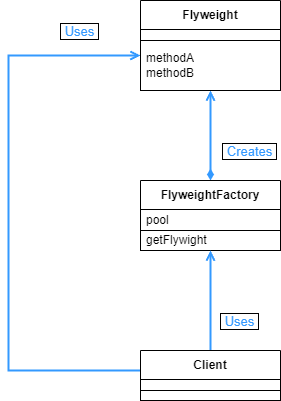

## Flywieght 패턴

- 인스턴스를 최대한 공유하고 쓸데없이 new 를 사용하지 않도록 해서 메모리 사용량을 줄인다.

<br>

<div align="center">
 
</div>

<br>

메모리를 많이 사용하는 무거운 인스턴스를 만들기 위해서 파일을 읽어와 큰 숫자를 기호로 표현하도록 했다. 이미 인스턴스가 있다면 기존의 인스턴스를 가지고 오는 싱글톤 패턴을 같이 확인할 수 있다.

<br>

```java
public class BigChar {
    private char charname;
    private String fontdata;

    public BigChar(char charname) {
        this.charname = charname;
        try {
            String filename = "big" + charname + ".txt";
            StringBuilder sb = new StringBuilder();
            for (String line : Files.readAllLines(Path.of(filename))) {
                sb.append(line);
                sb.append("\n");
            }
            this.fontdata = sb.toString();
        } catch (IOException e) {
            this.fontdata = charname + "?";
        }
    }

    public void print() {
        System.out.println(fontdata);
    }
}
```

<br>

big0.txt 와 같은 이름을 가진 파일을 읽어오는 클래스이다. 그 파일에는 숫자를 기호로 표현한 문자열이 있는데, 이 클래스에서 그 문자열을 읽어와서 다시 fontdata 에 담아서 출력한다.

<br>

```java
public class BigCharFactory {
    private Map<String, BigChar> pool = new HashMap<>();
    private static BigCharFactory singleton = new BigCharFactory();

    public BigCharFactory() {
    }

    public static BigCharFactory getInstance() {
        return singleton;
    }

    public synchronized BigChar getBigChar(char charname) {
        BigChar bc = pool.get(String.valueOf(charname));
        if (bc == null) {
            bc = new BigChar(charname);
            pool.put(String.valueOf(charname), bc);
        }
        return bc;
    }
}
```

<br>

BigChar 클래스의 인스턴스를 만드는 클래스라고 보면된다. 지금까지의 디자인 패턴들을 보면 알겠지만 factory 라는 이름이 들어가면 인스턴스를 생성하는 클래스라고 보면된다.

인스턴스 생성은 private 로 되어있다. 즉 외부에서는 이 클래스의 인스턴스를 생성하지 못한다. getInstance 와 같은 정적 팩토리 메소드를 통해서만 인스턴스에 접근할 수 있다.

싱글턴 패턴이 사용되어서 외부에서는 기존의 인스턴스에만 접근하게 된다. 이런 방식을 통해서 새로운 인스턴스 생성을 막아 메모리 사용량을 줄인다.

getBigChar 메소드에 synchronized 키워드를 사용했는데, 그 이유는 여러개의 스레드가 동시에 이 메소드를 호출하는 경우 기존 인스턴스 여부에 상관없이 새로운 인스턴스를 만들어 버릴 수 있기 때문이다.

물론 스레드가 많지 않다면 synchronized 를 사용하지 않는 편이 좋다. 성능이 느려질 수 있기 때문이다.

<br>

```java
public class BigString {
    private BigChar[] bigChars;

    public BigString(String string) {
        BigCharFactory factory = BigCharFactory.getInstance();
        bigChars = new BigChar[string.length()];
        for (int i = 0; i < bigChars.length; i++) {
            bigChars[i] = factory.getBigChar(string.charAt(i));
        }
    }

    public void print() {
        for (BigChar bc : bigChars) {
            bc.print();
        }
    }
}
```

<br>

생성자에서 보면 bigChars[] 에 할당할 인스턴스를 factory.getBigChar를 통해서 가지고온다. 지금까지 보면 싱글톤 패턴에다가 synchronized 까지 써가면서 최대한 new 사용을 막았다. 이렇게 메모리 리소스를 줄이는 것이 Flywight 패턴의 핵심이다.

<br>

```java
public class Main {
    public static void main(String[] args) {
        if (args.length == 0) {
            System.out.println("Usage: java Main digits");
            System.out.println("Example: java Main");
            System.exit(0);
        }

        BigString bs = new BigString(args[0]);
        bs.print();
    }
}
==================================================
......##........
..######........
......##........
......##........
......##........
......##........
..##########....
................

....######......
..##......##....
..........##....
......####......
....##..........
..##............
..##########....
................

......##........
..######........
......##........
......##........
......##........
......##........
..##########....
................
```

<br>

args 에 1, 2, 1 을 넣어주었다. 여기서 1 과 2는 새로 생성했겠지만, 그 다음 1은 기존의 인스턴스를 가지고 온다.

<br>

<div align="center">
 
</div>

<br>

메모리 사용을 최소화 하기 위해서 공유할 수 있는 부분은 최대한 공유를 하는데, 이 때문에 공유되는 부분을 잘 생각해야한다. 공유되는 부분을 변경하는 것으로 그 부분을 사용하는 모든 다른 부분에 영향이 갈 수 있다. 이는 싱글톤 패턴에서의 문제점과 같다.

다만 싱글톤에서는 하나의 인스턴스만 만들어서 전부 공유했지만, Flyweight 패턴에서는 공유할 부분과 그렇지 않은 부분을 나눌 수 있다. 공유되는 부분을 Intrinsic, 공유되지 않는 부분을 extrinsic 하다고 부른다.

만약 BigChar 가 색 정보를 가진다고 하는 경우, 동일한 BigChar 인스턴스는 항상 같은 색을 가지게 된다. 그런데 만약 BigString 에서 3번째 글자는 파란색과 같은 정보를 가지게 하면, 이 정보는 BigChar 에서는 공유되지 않는다. 이렇게 공유할 부분과 공유하지 않을 부분을 잘 나누는 것이 핵심이다.

<br>

```java
public BigString(String string, boolean shared) {
        if (shared) {
            initShared(string);
        } else {
            initUnshared(string);
        }
    }

    private void initShared(String string) {
        BigCharFactory factory = BigCharFactory.getInstance();
        bigChars = new BigChar[string.length()];
        for (int i = 0; i < bigChars.length; i++) {
            bigChars[i] = factory.getBigChar(string.charAt(i));
        }
    }

    private void initUnshared(String string) {
        bigChars = new BigChar[string.length()];
        for (int i = 0; i < bigChars.length; i++) {
            bigChars[i] = new BigChar(string.charAt(i));
        }
    }
```

<br>

메모리를 공유하는 경우와 그렇지 않은 경우를 나눈 다음, Main 메소드에서 실행해보면

<br>

```java
public class Main {
    private static BigString[] bsarray = new BigString[10000];
    public static void main(String[] args) {
        System.out.println("공유한 경우:");
        testAllocation(true);
        System.out.println("공유하지 않는 경우:");
        testAllocation(false);
    }

    public static void testAllocation(boolean shared) {
        for (int i = 0; i < bsarray.length; i++) {
            bsarray[i] = new BigString("121212", shared);
        }
        showMemory();
    }

    public static void showMemory() {
        Runtime.getRuntime().gc();
        long used = Runtime.getRuntime().totalMemory() - Runtime.getRuntime().freeMemory();
        System.out.println("사용 메모리 = " + used);
    }
}
=========================================================
공유한 경우:
사용 메모리 = 1594520
공유하지 않는 경우:
사용 메모리 = 14631000
```

<br>

거의 메모리 사용량이 9배가까이 차이나는 것을 볼 수 있다. 공유하는 부분을 잘 활용한다면 이렇게 메모리 리소스를 아낄 수 있다.