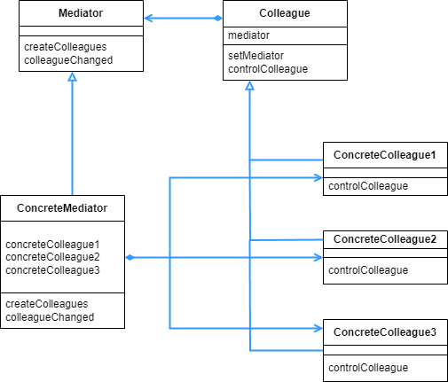

## Mediator 패턴

- 하나의 중재자가 존재하고, 중재자 이외의 모든 그룹 멤버는 중재자에게 보고하고, 중재자만 각 멤버에게 지시를 내린다.

<br>

<div align="center">
 
</div>

<br>

이번 예시는 Java 의 awt 라는 GUI 프레임워크를 사용한다. awt 를 이용해서 로그인 창을 구현하는데, 로그인 창은 다음과 같은 동작을 가진다.

- 게스트 로그인이 선택되어 있을 때는 사용자 이름과 패스워드가 비활성화 되어 문자열을 입력할 수 없다.
- 사용자 로그인이 선택되면 사용자 이름이 활성화 되어 문자열을 입력할 수 있다.
- 사용자 이름에 문자가 하나도 들어 있지 않으면 패스워드는 비활성화 된다.
- 사용자 이름에 문자가 하나라도 들어 있으면 패스워드는 활성화된다. (게스트 로그인일 경우 패스워드는 당연히 비활성화된다.)
- 사용자 이름과 패스워드 양쪽에 문자가 하나라도 들어있으면 OK 버튼이 활성화 되어 누를 수 있지만, 사용자 이름과 패스워드 중 어느 한쪽이라도 비어 있으면 OK 버튼은 비활성화 되어 누를 수 없다. (게스트 로그인일 경우 OK 버튼은 항상 활성화 된다.)
- Cancel 버튼은 항상 활성화 되어 있어 언제든지 누를 수 있다.

로그인 창에는 라디오, 버튼, 입력 창 등 각각의 구성 멤버들이 있다. 그렇다면 위의 동작 예시처럼 각각의 동작들은 어디에다가 작성해야할까? 각 멤버는 자기의 일만 하고 자기가 처리한 일은 중재자 에게 맡기고, 중재자가 받아서 처리하고 각 동작에 대한 응답을 중재자가 각 멤버에게 내려주면된다.

<br>

```java
public interface Mediator {
    public abstract void createColleagues();

    public abstract void colleagueChanged();
}
```

<br>

중재자의 추상클래스이다. 멤버를 생성하는 메소드와, 멤버의 요청을 받아드리는 메소드(colleagueChanged) 가 있다. 즉 각 멤버의 상태가 변하는 경우(ex 라디오 버튼 상태 변화) 이 메소드를 통해서 중재자로 상태 변화 보고가 된다.

<br>

```java
public interface Colleague {
    public abstract void setMediator(Mediator mediator);

    public abstract void setColleaguesEnabled(boolean enabled);
}
```

<br>

setMediator 는 누가 중재자인지 알려주는 메소드이다. 중재자를 호출시 여기서 설정한 중재자에게 보고하게 된다. setColleaguesEnabled는 중재자가 내려준 지시사항을 알려주는 메소드이다. 이 메소드로 각 멤버가 중재자로부터 지시를 받는다고 생각하면 된다.

<br>

```java
public class ColleagueButton extends Button implements Colleague {
    private Mediator mediator;

    public ColleagueButton(String caption) {
        super(caption);
    }

    @Override
    public void setMediator(Mediator mediator) {
        this.mediator = mediator;
    }

    @Override
    public void setColleaguesEnabled(boolean enabled) {
        setEnabled(enabled);
    }
}
```

<br>

awt 의 Button 클래스를 상속해서 로그인 창의 버튼 부분을 나타내는 멤버이다. 위에서 설명한 setMediator 로 중재자를 정해고, setColleaguesEnabled 로 중재자의 지시에 따른다.

<br>

```java
public class ColleagueTextField extends TextField implements TextListener, Colleague {
    private Mediator mediator;

    public ColleagueTextField(String text, int columns) {
        super(text, columns);
    }

    @Override
    public void textValueChanged(TextEvent e) {
        mediator.colleagueChanged();
    }

    @Override
    public void setMediator(Mediator mediator) {
        this.mediator = mediator;
    }

    @Override
    public void setColleaguesEnabled(boolean enabled) {
        setEnabled(enabled);
        setBackground(enabled ? Color.white : Color.lightGray);
    }
}
```

<br>

ColleagueButton 과 같다. ColleagueTextField 만의 특징으로는 비활성화 되는 경우에는 배경색이 밝은 회색으로, 활성화시에는 흰색으로 변한다. 활성/비활성은 중재자의 지시에 따라 결정된다.

<br>

```java
public class ColleagueCheckbox extends Checkbox implements ItemListener, Colleague {
    private Mediator mediator;

    public ColleagueCheckbox(String caption, CheckboxGroup group, boolean state) {
        super(caption, group, state);
    }

    @Override
    public void setMediator(Mediator mediator) {
        this.mediator = mediator;
    }

    @Override
    public void setColleaguesEnabled(boolean enabled) {
        setEnabled(enabled);
    }

    @Override
    public void itemStateChanged(ItemEvent e) {
        mediator.colleagueChanged();
    }
}
```

<br>

ColleagueTextField 와 비슷하다.

<br>

```java
public class LoginFrame extends Frame implements ActionListener, Mediator {
    private ColleagueCheckbox checkGuest;
    private ColleagueCheckbox checkLogin;
    private ColleagueTextField textUser;
    private ColleagueTextField textPass;
    private ColleagueButton buttonOk;
    private ColleagueButton buttonCancel;

    public LoginFrame(String title) {
        super(title);

        setBackground(Color.lightGray);

        setLayout(new GridLayout(4, 2));

        createColleagues();

        add(checkGuest);
        add(checkLogin);
        add(new Label("Username:"));
        add(textUser);
        add(new Label("Password:"));
        add(textPass);
        add(buttonOk);
        add(buttonCancel);

        colleagueChanged();

        pack();
        setVisible(true);
    }

    @Override
    public void actionPerformed(ActionEvent e) {
        System.out.println(e.toString());
        System.exit(0);
    }

    @Override
    public void createColleagues() {
        CheckboxGroup g = new CheckboxGroup();
        checkGuest = new ColleagueCheckbox("Guest", g, true);
        checkLogin = new ColleagueCheckbox("Login", g, false);

        textUser = new ColleagueTextField("",10);
        textPass = new ColleagueTextField("",10);
        textPass.setEchoChar('*');

        buttonOk = new ColleagueButton("OK");
        buttonCancel = new ColleagueButton("Cancel");

        checkGuest.setMediator(this);
        checkLogin.setMediator(this);
        textUser.setMediator(this);
        textPass.setMediator(this);
        buttonOk.setMediator(this);
        buttonCancel.setMediator(this);

        checkGuest.addItemListener(checkGuest);
        checkLogin.addItemListener(checkLogin);
        textUser.addTextListener(textUser);
        textPass.addTextListener(textPass);
        buttonOk.addActionListener(this);
        buttonCancel.addActionListener(this);
    }

    @Override
    public void colleagueChanged() {
        if (checkGuest.getState()) {
            textUser.setColleaguesEnabled(false);
            textPass.setColleaguesEnabled(false);
            buttonOk.setColleaguesEnabled(true);
        } else {
            textUser.setColleaguesEnabled(true);
            userpassChanged();
        }
    }

    private void userpassChanged() {
        if (textUser.getText().length() > 0) {
            textPass.setColleaguesEnabled(true);
            if (textPass.getText().length() > 0) {
                buttonOk.setColleaguesEnabled(true);
            } else {
                buttonOk.setColleaguesEnabled(false);
            }
        } else {
            textPass.setColleaguesEnabled(false);
            buttonOk.setColleaguesEnabled(false);
        }
    }
}
=====================================================================
public class Main {
    public static void main(String[] args) {
        new LoginFrame("Mediator Sample");
    }
}
```

<br>

로그인 창에 대한 모든 정보를 받고 지시를 내리는 LoginFram 클래스이다. 사실상의 메인 클래스로, 아래의 메인 클래스는 그저 인스턴스 생성만 하고 있는 것을 볼 수 있다.

createColleagues 부터 보면, 일단 각 구성 멤버를 생성한다. 버튼, 입력창, 라디오 버튼을 생성하고, 각 멤버의 중재자 또한 설정한다.

colleagueChanged 와 userpassChanged 에서는 각 멤버의 변경이 있어서 각 멤버가 중재자에게 보고를 하면, 중재자는 보고 받은 내용을 가지고 조건에 따라서 어떻게 지시를 내릴지 판단하고 각 멤버에게 지시를 내린다. 이 부분이 Mediator 패턴의 핵심으로, 각 멤버는 자신을 활성화/비활성화 하는 메소드는 있지만, 언제 활성/비활성 할지에 대한 부분은 존재하지 않는다. 전적으로 중재자가 처리하게 되는것이다.

<br>

<div align="center">
 
</div>

<br>

실행 하면 다음과 같은 창이 뜨고, 앞서 클래스 다이어그램 아랫부분에서 설명한 동작들을 확인해 볼 수 있다. 입력 후 OK 를 누르면 actionPerformed 메소드가 실행된다.

<br>

<div align="center">
 
</div>

<br>

앞서 본 예시보다는 덜 복잡하지만, 일반화한 클래스 다이어그램도 복잡한 편이다. 하지만 각 멤버는 자기 상태를 변경하는 메소드만 있지, 언제 어떻게 변화시킬 것인지에 대한 로직은 존재하지 않는다. 메인 로직은 전부 ConcreteMediator 쪽에 있으므로, 버그가 발생하는 경우에는 ConcreteMediator 부분을 디버깅 하면 된다.

멤버의 수가 늘어나면, 그만큼 서로 교류해야하는 경우의 수가 늘어난다. A, B, C 라면 각각 서로의 통신 경로 경우의 수가 6개 인데, A, B, C, D 가 되면 12개가 된다. 하나 늘어날 때 마다 통신 경로 경우의 수는 훨씬 많아진다.

이런 경우 중재자가 중앙에서 관리한다면, 중재자는 각 멤버의 수만큼만 통제하면 되기 때문에 가파르게 증가하는 통신 경로를 줄여줄 수 있다.

각 멤버는 다른 멤버에 의존하는 부분이 없기에, 재사용하기 용이하다. 하지만 ConcreteMediator 부분은 재사용하기 힘들다. 각각의 멤버들과 모두 통신하고 있기 때문이다. 따라서 새로운 창에 멤버들을 가져다 쓰기는 좋지만, ConcreteMediator 를 재사용하기에는 어려움이 있다.