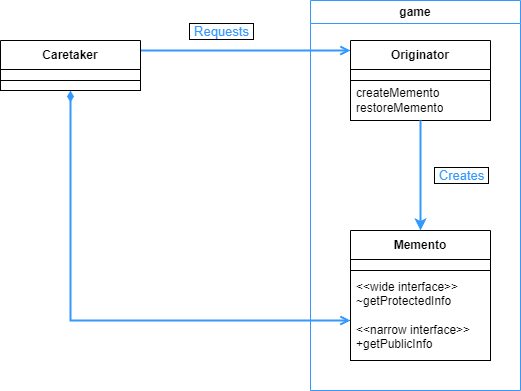

## Memento 패턴

- 실행 취소와 같이 예전 상태로 인스턴스를 복원시키고 싶은 경우, 인스턴스의 정보를 저장해 놓은 후, 그 정보를 가지고 인스턴스를 저장했던 상태로 다시 복원 할 수 있는 패턴이다.

<br>

<div align="center">
 
</div>

<br>

이번예시는 게임을 하는데, 게임을 해서 돈이 어느 정도 이상으로 증가하면 그 때 상태를 저장해 놓고, 만약 돈을 어느 정도 이하로 잃게 되면 저장해 놓았던 상태를 다시 가지고 온다.

게임을 하는 규칙과, 게임의 상태를 저장하는 Memento 인스턴스를 저장/복원 시키는 메소드를 Gamer 클래스에다가 작성한다. Memento 클래스에서는 그저 게임의 상태를 저장해 놓을 필드와 메소드가 존재한다.

<br>

```java
public class Memento {
    private int money;
    private List<String> fruits;

    public int getMoney() {
        return money;
    }

    // 생성자는 default 로 한다.
    // Main 함수에서 new Memento 와 같이 호출 불가능 하기 위함
    Memento(int money) {
        this.money = money;
        this.fruits = new ArrayList<>();
    }

    void addFruits(String fruit) {
        fruits.add(fruit);
    }

    List<String> getFruits() {
        return new ArrayList<>(fruits);
    }
}
```

<br>

앞서 말했듯 Memento 클래스에서는 상태를 저장할 필드와 메소드를 가진다. 여기서 생성자의 경우 접근제어자가 default 이므로, 같은 패키지에서만 호출 할 수 있다. 즉 Main 함수 에서는 호출하지 못한다. Main 함수에서 Memento 인스턴스를 호출하고 싶다면 Gamer.restoreMemento 와 같이 메소드를 따로 호출해야 한다.

이렇게 Main 함수에서 Memento 클래스에 접근하지 못하도록 하는 이유는 외부와의 독립성을 유지하기 위함이다. 만약 외부에서 Memento 클래스에 자유롭게 접근해서 인스턴스 생성을 한다면, Gamer 부분에 수정이 있는 경우 Main 과 같은 외부 클래스쪽에도 수정을 해야하는 상황이 발생할 수 있다.

<br>

```java
public class Gamer {
    private int money;
    private List<String> fruits = new ArrayList<>();
    private Random random = new Random();

    private static String[] fruitsName = {
        "사과", "포도", "바나나", "오렌지"
    };

    public Gamer(int money) {
        this.money = money;
    }

    public int getMoney() {
        return money;
    }

    public void bet() {
        int dice = random.nextInt(6) + 1;
        if (dice == 1) {
            money += 100;
            System.out.println("소지금이 증가했습니다.");
        } else if (dice == 2) {
            money /= 2;
        } else if (dice == 6) {
            String f = getFruit();
            System.out.println("과일(" + f + ")를 받았습니다.");
            fruits.add(f);
        } else {
            System.out.println("변동 사항이 없습니다.");
        }
    }

    public Memento createMemento() {
        Memento m = new Memento(money);
        for (String f : fruits) {
            if (f.startsWith("맛있는 ")) {
                m.addFruits(f);
            }
        }
        return m;
    }

    public void restoreMemento(Memento memento) {
        this.money = memento.getMoney();
        this.fruits = memento.getFruits();
    }

    @Override
    public String toString() {
        return "[money = " + money + ", fruits = " + fruits + "]";
    }

    private String getFruit() {
        String f = fruitsName[random.nextInt(fruitsName.length)];
        if (random.nextBoolean()) {
            return "맛있는 " + f;
        } else {
            return f;
        }
    }
}
```
<br>

게임 규칙과 Memento 인스턴스의 생성/복원 메소드를 작성했다. 외부에서 Memento 인스턴스를 호출하려면 이 클래스를 통해서 호출해야한다.

앞서 보았듯이 Gamer 클래스는 Memento 클래스와 같은 패키지이다. 따라서 접근제어자가 default 인 메소드를 호출해서 사용할 수 있다.

<br>

```java
public class Main {
    public static void main(String[] args) {
        Gamer gamer = new Gamer(100);
        Memento memento = gamer.createMemento();

        for (int i = 0; i < 100; i++) {
            System.out.println("==== " + i);
            System.out.println("상태:" + gamer);

            gamer.bet();

            System.out.println("소지금은 " + gamer.getMoney() + "원이 되었습니다.");
            System.out.println("memento.getMoney() = " + memento.getMoney());

            if (gamer.getMoney() > memento.getMoney()) {
                System.out.println("*많이 늘었으니 현재 상태를 저장하자!");
                memento = gamer.createMemento();
            } else if (gamer.getMoney() < memento.getMoney() / 2) {
                System.out.println("*많이 줄었으니 이전 상태를 복원하자");
                gamer.restoreMemento(memento);
            }

            try {
                Thread.sleep(100);
            } catch (InterruptedException e) {
                e.printStackTrace();
            }
            System.out.println();
        }
    }
}
============================================================================

...... 생략 ......

==== 87
상태:[money = 525, fruits = [맛있는 오렌지, 맛있는 오렌지, 맛있는 오렌지, 맛있는 바나나, 맛있는 바나나, 바나나, 포도, 포도]]
소지금은 262원이 되었습니다.
memento.getMoney() = 1050
*많이 줄었으니 이전 상태를 복원하자

==== 88
상태:[money = 1050, fruits = [맛있는 오렌지, 맛있는 오렌지, 맛있는 오렌지, 맛있는 바나나, 맛있는 바나나]]
변동 사항이 없습니다.
소지금은 1050원이 되었습니다.
memento.getMoney() = 1050

==== 89
상태:[money = 1050, fruits = [맛있는 오렌지, 맛있는 오렌지, 맛있는 오렌지, 맛있는 바나나, 맛있는 바나나]]
소지금이 증가했습니다.
소지금은 1150원이 되었습니다.
memento.getMoney() = 1050
*많이 늘었으니 현재 상태를 저장하자!

...... 생략 ......
```

<br>

Main 클래스에서는 조건에 따라서 언제 Memento 인스턴스를 저장할지, 불러올지 결정한다.  앞서 본 Gamer 클래스에서는 인스턴스의 저장/복원 메소드를 작성했다. 이렇게 역할을 나누어 놓으면 수정할 때 용이해진다.

<br>

<div align="center">
 
</div>

<br>

클래스 다이어그램의 Memento 클래스를 보면 wide 인터페이스와 narrow 인터페이스 라는 말이 있다. wide 는 클래스 내부에 온전히 접근할 수 있는 경우를 말하고, narrow 는 호출할 수 있는 메소드에 한계가 있어서 내부에 온전히 접근할 수 없는 것을 의미한다.

Main 클래스는 Memento 인스턴스를 new 를 통해서 생성할 수 없었다. Memento 클래스의 생성자가 default 접근제어자를 가지고 있었기 때문이다. 반면 Gamer 클래스는 가능했다. 이처럼 역할을 나누어서 클래스를 작성함으로써 개발과 유지보수에 강점을 가지게 된다.

Memento 인스턴스를 메모리에서만 저장해 놓는다면 큰 문제가 안되지만, 만약 파일로 저장해 놓는다면 이 파일의 ‘유효기간’ 이 문제가 될 수 있다. 만약 추후에 프로그램의 전체 버전이 올라가는 경우 저장해 놓은 Memento 파일이 호환이 되지 않아서 불러올 수 없을수도 있기 때문이다.