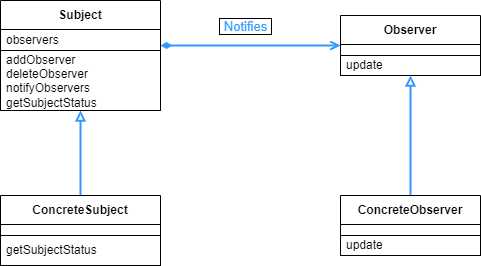

## Observer 패턴

- 관찰 대상자의 상태가 변하면, 관찰자에게 그 상태를 알려주는 패턴이다.

<br>

<div align="center">
 
</div>

<br>

NumberGenerator 에서는 정해진 로직에 따라서 숫자를 생성한다. 그리고 숫자를 생성하는 행위, 즉 상태가 변하는 행동을 하면 notifyObservers 를 통해서 관찰자들에게 변한 상태를 전달해준다. 그러면 변한 상태를 전달받은 Observer 들은 해당 정보를 가지고 처리를 한다.

<br>

```java
public interface Observer {
    public abstract void update(NumberGenerator generator);
}
```

<br>

관찰자의 인터페이스이다. 상태 변화를 인지하는 경우 update 메소드를 실행하게 된다.

<br>

```java
public abstract class NumberGenerator {
    private List<Observer> observers = new ArrayList<>();

    public void addObserver(Observer observer) {
        observers.add(observer);
    }

    public void deleteObserver(Observer observer) {
        observers.remove(observer);
    }

    public void notifyObservers() {
        for (Observer o : observers) {
            o.update(this);
        }
    }

    public abstract int getNumber();

    public abstract void execute();
}
```

<br>

상태 변화를 일으키는 주체로, 보통 Subject 라고 불리우는 부분이다. 여기서는 관찰자를 추가하거나 삭제하는 메소드와, Observer 에게 상태 변화를 알려주는 notifyObservers 메소드가 있다.

<br>

```java
public class RandomNumberGenerator extends NumberGenerator {
    private Random random = new Random();
    private int number;

    @Override
    public int getNumber() {
        return number;
    }

    @Override
    public void execute() {
        for (int i = 0; i < 20; i++) {
            number = random.nextInt(50);
            notifyObservers();
        }
    }
}
```

<br>

NumberGenerator 를 상속받은 하위 클래스로, 구체적으로 어떻게 상태변화가 일어날지 작성해 놓은 부분이다. execute 메소드를 보면 숫자가 랜덤으로 생겼을 때 notifyObservers() 메소드를 호출 해서 관찰자들에게 알려준다.

<br>

```java
public class DigitObserver implements Observer {
    @Override
    public void update(NumberGenerator generator) {
        System.out.println("DigitObserver:" + generator.getNumber());
        try {
            Thread.sleep(100);
        } catch (InterruptedException e) {

        }
    }
}
```

<br>

Observer 의 하위 클래스로, 상태 변화를 전달받았을 때 어떤식으로 처리할 지 작성해 놓았다. 스레드 슬립을 한 이유는 상태 변화에 따른 각 Observer 의 처리 및 출력을 잘 알아보기 위해서이다.

<br>

```java
public class GraphObserver implements Observer {

    @Override
    public void update(NumberGenerator generator) {
        System.out.print("GraphObserver:");
        int count = generator.getNumber();
        for (int i = 0; i < count; i++) {
            System.out.print("*");
        }
        System.out.println("");
        try {
            Thread.sleep(100);
        } catch (InterruptedException e) {

        }
    }
}
```

<br>

DigitObserver와 같은 Observer 를 구현하는 하위 클래스이다.

<br>

```java
public class Main {
    public static void main(String[] args) {
        NumberGenerator generator = new RandomNumberGenerator();
        Observer observer1 = new DigitObserver();
        Observer observer2 = new GraphObserver();
        generator.addObserver(observer1);
        generator.addObserver(observer2);
        generator.execute();
    }
}
===================================================================
.......(생략)
DigitObserver:42
GraphObserver:******************************************
DigitObserver:29
GraphObserver:*****************************
DigitObserver:17
GraphObserver:*****************
DigitObserver:46
GraphObserver:**********************************************
DigitObserver:37
GraphObserver:*************************************
DigitObserver:47
GraphObserver:***********************************************
```

<br>

Main 클래스를 보면 일단 관찰자들을 등록한다음에, execute 를 호출해서 subject 의 변화를 시작하고, 변화가 일어났을 때 Observer 들에게 알려준다. 그러면 Observer 는 그 변화에 따른 각자의 update 메소드를 호출한다.

<br>

<div align="center">
 
</div>

<br>

이름은 관찰자지만, 사실 관찰 하기 보다는 변한 상태를 전달 받는다는 말이 더 어울린다. Subject 의 변화가 생길때, Subject 쪽에서는 Observer 를 호출하는 메소드를 같이 로직에 넣어서 Observer 들은 그 변화를 받아서 로직을 진행한다.

흔히 Pub/Sub 라고 부르는 발행/구독 형식이 더 설명에 가까운 말이다. Subject 가 변화를 일으켜서 발행을 하면, 이 Subject 에 구독하고 있는 Observer 들에게 정보를 전달해주기 때문이다.

Observer 의 update 메소드가 Subject 의 변화를 일으켜서는 안된다. 그러면 Subject 의 변화가 시작되면 → Observer 의 update 메소드가 실행되고 → 다시 Subject 의 변화를 일으킨다. 이렇게 무한 루프를 일으킬 수 있으므로, update 메소드 작성 시 주의해야 한다.

또한 ConcreteObserver 들 간에는 메소드 호출 순서에 서로 영향이 없어야 한다. 만약 A 라는 Observer 의 update 메소드를 먼저 호출했는데, 이게 B 의 update 메소드 호출에 영향을 주어서 실행이 잘 안되기라도 하면 안된다. 이 부분 또한 Observer 패턴 사용시 주의해야 한다.

MVC 패턴에서 Model 과 View 의 관계도 Observer 패턴에서 Subject 와 Observer 관계로 볼 수 있다. Model 이 변화하면 이를 View 에다가 알려주고, View 는 이 변화된 Model 들을 토대로 화면에 데이터를 보여준다.