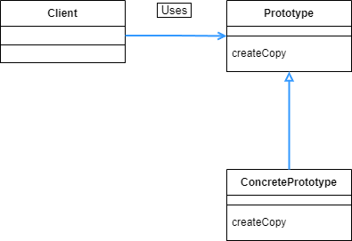

## Prototype 패턴

- 클래스에서 인스턴스를 생성하는 대신, 인스턴스로부터 다른 인스턴스를 생성하는 패턴이다.
- 취급할 오브젝트가 너무 많거나, 클래스로부터 인스턴스 생성이 어렵거나, 프레임워크와 생성하는 인스턴스를 분리하고 싶은 경우에 사용한다.

<br>

<div align="center">
  
</div>

<br>

우선 Product 와 하위 클래스 부분만을 보면 Template Method 패턴과 같다. 이렇게 만들어진 인스턴스를 Manager 부분에서 복제하는 메소드를 이용해서 인스턴스 복사를 하는 과정이라고 보면 된다.

이번 예시 구현에서는 java 의 Cloneable 인터페이스를 사용해서 복사를 한다. 여기서 하는 복사는 얕은 복사이다.

<br>

```java
package prototype.framwork;

public interface Product extends Cloneable {
    void use(String s);
    Product createCopy();
}
```

<br>

우선 Product 인터페이스를 만든다. Product 의 인스턴스를 복제할 수 있도록 하기 위해서 Cloneable 을 상속받게 한다.

<br>

```java
package prototype.framwork;

import java.util.HashMap;
import java.util.Map;

public class Manager {
    private Map<String, Product> showcase = new HashMap<>();

    public void register(String name, Product prototype) {
        showcase.put(name, prototype);
    }

    public Product create(String prototypeName) {
        Product p = showcase.get(prototypeName);
        return p.createCopy();
    }
}
```

<br>

인스턴스를 복제하는 부분인 Manager 이다. 이 예시에서는 이름과 Product 인터페이스를 넘겨주면 showcase 에 등록을 하고, create 메소드를 통해서 복제된 인스턴스를 return 받는다.

<br>

```java
import prototype.framwork.Product;

public class MessageBox implements Product {
    private char decochar;

    public MessageBox(char decochar) {
        this.decochar = decochar;
    }

    @Override
    public void use(String s) {
        int decolen = 1 + s.length() + 1;
        for (int i = 0; i < decolen; i++) {
            System.out.print(decochar);
        }
        System.out.println();
        System.out.println(decochar + s + decochar);
        for (int i = 0; i < decolen; i++) {
            System.out.print(decochar);
        }
        System.out.println();
    }

    @Override
    public Product createCopy() {
        Product p = null;
        try {
            p = (Product)clone();
        } catch (CloneNotSupportedException e) {
            e.printStackTrace();
        }
        return p;
    }
}
```

<br>

Product 를 구체화 시킨 클래스 중 하나이다. Product 를 구현하고 있고, use 부분에서 실제 사용되는 것을 구체화 하고, createCopy 부분에서 어떻게 복사할 건지 구체화하고 있다.

여기서는 Clonable 을 상속받은 점을 이용해서 clone() 메소드를 사용해서 복사를 한다. 이 clone() 메소드를 사용하면 앞서 언급했던 얕은 복사가 이루어진다. clone() 메소드는 자신의 클래스 및 하위 클래스에서만 호출 할 수 있으므로 다른 클래스의 요청으로 복제할 때는 (Product) 처럼 캐스팅이 필요하다.

<br>

```java
public class UnderlinePen implements Product {
    private char ulchar;

    public UnderlinePen(char ulchar) {
        this.ulchar = ulchar;
    }

    @Override
    public void use(String s) {
        int ulen = s.length();
        System.out.println(s);
        for (int i = 0; i < ulen; i++) {
            System.out.print(ulchar);
        }
        System.out.println();
    }

    @Override
    public Product createCopy() {
        Product p = null;
        try {
            p = (Product)clone();
        } catch (CloneNotSupportedException e) {
            e.printStackTrace();
        }
        return p;
    }
}
```

<br>

MessageBox 클래스와 같다. 또 다른 하나의 구체적으로 Product 를 구현한 클래스이다.

<br>

```java
public class Main {
    public static void main(String[] args) {
        Manager manager = new Manager();
        UnderlinePen upen = new UnderlinePen('-');
        MessageBox mbox = new MessageBox('*');
        MessageBox sbox = new MessageBox('/');

        manager.register("strong message", upen);
        manager.register("warning box", mbox);
        manager.register("slash box", sbox);

        Product p1 = manager.create("strong message");
        p1.use("Hello World");

        Product p2 = manager.create("warning box");
        p2.use("Hello World");

        Product p3 = manager.create("slash box");
        p3.use("Hello World");
    }
}
========================================================
Hello World
-----------
*************
*Hello World*
*************
/////////////
/Hello World/
/////////////
```

<br>

각 Product 를 선언한 다음, manager.register 로 각 Product 를 등록한다. 그 후 create() 를 통해서 인스턴스 복사 후 사용하는 것을 볼 수 있다.

<br>

<div align="center">
  
</div>

<br>

Prototype 패턴을 일반화 하면 다음과 같다. ConcretePrototype 에는 앞서 본 예시처럼 하나 이상의 구체적인 클래스들이 올 수 있다.

그냥 인스턴스를 new 로 생성하면 될 것을 왜 이렇게 복잡한 수순을 밟을까에 대해서 다시 생각해보면, 일단 위의 Main 클래스를 봤을 때 Product 가 중 2개의 하위 클래스가 등장했고, 총 Product 의 갯수는 3개 였다. 만약 3개가 아니라 훨씬 많은 숫자가 등장하는 경우 인스턴스 복사가 불가능해서 일일이 클래스를 생성한다면 클래스의 갯수가 매우 많아진다. 이런 경우에 Prototype 을 사용하면 원형 인스턴스를 복사해 와서 적은 클래스 갯수로도 많은 원형을 사용할 수 있다.

Prototype 패턴도 Template Method 나 Factory Method 처럼 인터페이스/추상 클래스와 하위 클래스로 나누고, 인스턴스를 복제하는 부분도 하위 클래스가 아닌 인터페이스를 사용한다. 이러한 점 때문에 하위 클래스에 의존하지 않는다는 점을 알 수 있다. 이런 점은 유지 보수를 용이하게 해준다. 의존관계가 있다면 문제가 각 의존관계를 타고가서 수정해야할 부분이 많아지기 때문이다.