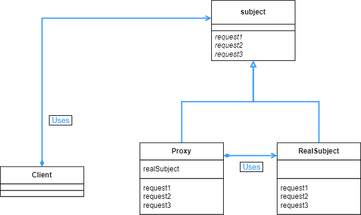

## Proxy 패턴

- 대리자를 앞세워서 가능한 한 처리를 대신하도록 만든다.

<br>

<div align="center">
 
</div>

<br>

이번 예시에서는 Main 에서 Printer 인스턴스를 생성할 때는 PrinterProxy 를 경유하도록 해놓았다. 그리고 setPrinterName 이나 getPrinterName 메소드 같은 경우에는 Printer 클래스가 아니라 PrinterProxy 에서 대신 처리하도록 했다.

<br>

```java
public interface Printable {
    public abstract void setPrinterName(String name);
    public abstract String getPrinterName();
    public abstract void print(String string);
}
```

<br>

Printer 와 PrinterProxy 를 동일시 하기 위한 인터페이스 이다.

<br>

```java
public class Printer implements Printable {
    private String name;

    public Printer() {
        heavyJob("Printer 인스턴스 생성 중");
    }

    public Printer(String name) {
        this.name = name;
        heavyJob("Printer 인스턴스(" + name + ") 생성 중");
    }

    @Override
    public void setPrinterName(String name) {
        this.name = name;
    }

    @Override
    public String getPrinterName() {
        return name;
    }

    @Override
    public void print(String string) {
        System.out.println("=== " + name + " ===");
        System.out.println(string);
    }

    private void heavyJob(String msg) {
        System.out.print(msg);
        for (int i = 0; i < 5; i++) {
            try {
                Thread.sleep(1000);
            } catch (InterruptedException e) {

            }
            System.out.print(".");
        }
        System.out.println("완료");
    }
}
```

<br>

Printer 클래스를 보면, PrinterProxy 가 작성된 부분이 없다. 즉 Printer 는 PrinterProxy 를 알지 못한다. 따라서 본인이 호출되었을 때 누가 호출한 것인지 알 수가 없다.

heavyJob의 경우 대리자가 아닌 본인이 해결해야 한다는 의미로 만든 메소드이다. 처리할 수 있는 부분은 Proxy 에서 처리하고, 그렇지 않은 부분은 본인이 직접 해야한다는 의미이다.

<br>

```java
public class PrinterProxy implements Printable {
    private String name;
    private Printer real;

    public PrinterProxy() {
        this.name = "No Name";
        this.real = null;
    }

    public PrinterProxy(String name) {
        this.name = name;
        this.real = null;
    }

    @Override
    public synchronized void setPrinterName(String name) {
        if (real != null) {
            real.setPrinterName(name);
        }
        this.name = name;
    }

    @Override
    public String getPrinterName() {
        return name;
    }

    @Override
    public void print(String string) {
        realize();
        real.print(string);
    }

    private synchronized void realize() {
        if (real == null) {
            real = new Printer(name);
        }
    }
}
```

<br>

Printer 클래스의 대리자 역할을 하는 클래스로, realize 메소드를 보면 Printer 인스턴스를 생성하는 부분이 있다.

realize 메소드를 보면 synchronized 를 사용했는데, 이는 멀티 스레드 상황에서 Printer 클래스의 name 과 PrinterProxy 클래스의 name 이 같지 않게되는 상황을 막아준다. setPrinterName 하는 동안에 realize 를 호출해서 PrinterProxy 클래스의 name 이 설정되는 순간 다른 name 으로 Printer 클래스의 인스턴스를 생성할 수 있기 때문이다.

<br>

```java
public class Main {
    public static void main(String[] args) {
        Printable p = new PrinterProxy("Alice");
        System.out.println("이름은 현재 " + p.getPrinterName() + "입니다.");
        p.setPrinterName("Bob");
        System.out.println("이름은 현재 " + p.getPrinterName() + "입니다.");
        p.print("Hello World");
    }
}
=============================================================================
이름은 현재 Alice입니다.
이름은 현재 Bob입니다.
Printer 인스턴스(Bob) 생성 중.....완료
=== Bob ===
Hello World
```

<br>

getPrinterName, setPrinterName 을 사용할 떄는 PrinterProxy 에서 처리하다가, print() 메소드 호출시에는 Printer 인스턴스가 생성되어서 출력되는 것을 볼 수 있다.

<br>

<div align="center">
 
</div>

<br>

대리자가 본인 대신에 처리할 수 있는 일들을 미리 처리해주면 성능이 올라갈 수 있다. 예를 들어서 어떤 어플리케이션을 시작할 때 실행하지 않는 기능까지 전부 초기화 한다면 시작 시간이 길어진다. 이럴 때 가능한 처리를 미리 대리자가 실행해주고, 무거운 처리를 늦추는 것으로 시작 시간을 줄일 수 있다.

프록시 부분은 투과적인 특성을 가진다. 이 말은 프록시가 RealSubject 사이에 들어가도, 들어가지 않아도 Client 부분에서는 RealSubject 를 사용하는데 문제가 없다. 언제든 사이에 넣을 수 있는 것이다.

네트워크에서 흔히 프록시라고 부르는 부분도 디자인 패턴과 유사한 성격을 가진다. HTTP 프록시의 경우 클라이언트와 웹서버 사이에 들어가서 요청을 미리 받는다. 사용자 입장에서는 웹서버에 요청할 때 프록시 서버를 크게 신경쓰지 않아도 된다. 이건 웹서버에서도 마찬가지다.

이렇게 요청이 들어왔을 때, 프록시 서버에서 미리 웹 페이지를 캐싱해 놓으면 성능을 올릴 수 있다. 굳이 웹서버 까지 요청이 도달하지 않아도 클라이언트 입장에서 원하는 응답을 빠르게 얻을 수 있기 때문이다.