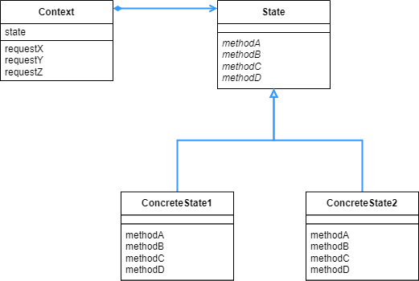

## State 패턴

- 상태를 ‘클래스’로 만들어서 사용하는 패턴이다.

<br>

<div align="center">
 
</div>

<br>

이번 예시에서는 시간에 따라서 다른 출력값을 보이는 GUI 인터페이스를 구현한다. 시간에 따라서 다른 동작을 보여야 한다면, 보통은 if 와 같은 조건문을 써서 조건에 따라서 동작을 나눈다.

하지만 상태 자체를 클래스로 만들면, if 문을 쓰지 않아도 된다. 그저 시간에 따라서 인스턴스를 변경한다면, 그 클래스에 정의된 메소드를 알아서 호출해 준다.

<br>

```java
public interface State {
    public abstract void doClock(Context context, int hour);
    public abstract void doUse(Context context);
    public abstract void doAlarm(Context context);
    public abstract void doPhone(Context context);
}
```

<br>

상태의 인터페이스이다. 이걸 구체화 시켜서 각 상태에 대한 동작을 나눈다.

<br>

```java
public interface Context {
    public abstract void setClock(int hour);
    public abstract void changeState(State state);
    public abstract void callSecurityCenter(String msg);
    public abstract void recordLog(String msg);
}
```

<br>

GUI 인터페이스에서의 동작을 위한 인터페이스이다. 상태를 이용할 부분이라고 생각하면 된다.

<br>

```java
public class DayState implements State {
    private static DayState singleton = new DayState();

    private DayState() {
    }

    public static State getInstance() {
        return singleton;
    }

    @Override
    public void doClock(Context context, int hour) {
        if (hour < 9 || 17 <= hour) {
            context.changeState(NightState.getInstance());
        }
    }

    @Override
    public void doUse(Context context) {
        context.recordLog("금고 사용(주간)");
    }

    @Override
    public void doAlarm(Context context) {
        context.callSecurityCenter("비상벨(주간)");
    }

    @Override
    public void doPhone(Context context) {
        context.callSecurityCenter("일반 통화(주간)");
    }

    @Override
    public String toString() {
        return "[주간]";
    }
}
```

<br>

시간이 낮일 때를 나타내는 클래스이다. 보면 시간이 낮에 해당하지 않는 경우 doClock 메소드에서 밤 상태를 나타내는 클래스의 인스턴스를 호출하도록 되어있다. 이렇게 각 상태를 나타내는 클래스에서 조건에 따라 인스턴스를 변경하는 것으로 동작을 변경한다.

<br>

```java
public class NightState implements State {
    private static NightState singleton = new NightState();

    private NightState() {
    }

    public static State getInstance() {
        return singleton;
    }

    @Override
    public void doClock(Context context, int hour) {
        if (9 <= hour && hour < 17) {
            context.changeState(DayState.getInstance());
        }
    }

    @Override
    public void doUse(Context context) {
        context.recordLog("금고 사용(야간)");
    }

    @Override
    public void doAlarm(Context context) {
        context.callSecurityCenter("비상벨(야간)");
    }

    @Override
    public void doPhone(Context context) {
        context.callSecurityCenter("일반 통화(야간)");
    }

    @Override
    public String toString() {
        return "[야간]";
    }
}
```

<br>

이번에는 밤 상태를 나타내는 클래스이다. 여기에서도 마찬가지로 doClock 부분에서 조건에 따라 DayState 의 인스턴스를 호출하도록 되어있다.

<br>

```java
public class SafeFrame extends Frame implements ActionListener, Context {
    private TextField textClock = new TextField(60);
    private TextArea textScreen = new TextArea(10, 60);
    private Button buttonUse = new Button("금고 사용");
    private Button buttonAlarm = new Button("비상벨");
    private Button buttonPhone = new Button("일반 통화");
    private Button buttonExit = new Button("종료");

    private State state = DayState.getInstance();

    public SafeFrame(String title) {
        super(title);
        setBackground(Color.lightGray);
        setLayout(new BorderLayout());

        add(textClock, BorderLayout.NORTH);
        textClock.setEditable(false);

        add(textScreen, BorderLayout.CENTER);
        textScreen.setEditable(false);

        Panel panel = new Panel();
        panel.add(buttonUse);
        panel.add(buttonAlarm);
        panel.add(buttonPhone);
        panel.add(buttonExit);

        add(panel, BorderLayout.SOUTH);

        pack();
        setVisible(true);

        buttonUse.addActionListener(this);
        buttonAlarm.addActionListener(this);
        buttonPhone.addActionListener(this);
        buttonExit.addActionListener(this);
    }

    @Override
    public void actionPerformed(ActionEvent e) {
        System.out.println(e.toString());
        if (e.getSource() == buttonUse) {
            state.doUse(this);
        } else if (e.getSource() == buttonAlarm) {
            state.doAlarm(this);
        } else if (e.getSource() == buttonPhone) {
            state.doPhone(this);
        } else if (e.getSource() == buttonExit) {
            System.exit(0);
        } else {
            System.out.println("?");
        }
    }

    @Override
    public void setClock(int hour) {
        String clockstring = String.format("현재 시간은 %2d:00", hour);
        System.out.println(clockstring);
        textClock.setText(clockstring);
        state.doClock(this, hour);
    }

    @Override
    public void changeState(State state) {
        System.out.println(this.state + "에서" + state + "으로 상태가 변화했습니다.");
        this.state = state;
    }

    @Override
    public void callSecurityCenter(String msg) {
        textScreen.append("call! " + msg + "\n");
    }

    @Override
    public void recordLog(String msg) {
        textScreen.append("record ... " + msg + "\n");
    }
}
```

<br>

GUI 인터페이스를 구체화한 클래스이다. 여기서 볼 부분은 actionPerformed 메소드이다. 보면 그저 state.doUse 와 같이 상태에 대한 조건문은 들어가있지 않는다. 그저 state 라는 인터페이스만을 호출할 뿐이다. 상태 그자체를 의미하는 클래스에서 알아서 조건에 따라 인스턴스를 변경해 주기 때문에, 여기서는 상태의 조건에 대한 것을 신경쓰지 않아도 된다.

<br>

```java
public class Main {
    public static void main(String[] args) {
        SafeFrame frame = new SafeFrame("State Sample");
        while (true) {
            for (int hour = 0; hour < 24; hour++) {
                frame.setClock(hour);
                try {
                    Thread.sleep(1000);
                } catch (InterruptedException e) {
                }
            }
        }
    }
}
=================================================================
..... 생략 .....

현재 시간은  7:00
현재 시간은  8:00
현재 시간은  9:00
[야간]에서[주간]으로 상태가 변화했습니다.
현재 시간은 10:00
현재 시간은 11:00

..... 생략 .....
```

<br>

<div align="center">
 
</div>

<br>

실행하는 경우 Java 의 awt 프레임워크를 사용해서 위와같은 GUI 창을 띄울 수 있다. 1초마다 시간이 1시간씩 변경하도록 해서 시간때에 따라 State 의 인스턴스가 변경되고, 그에따라 아래 버튼을 눌렀을 때 그 상태 클래스의 메소드가 호출된다.

changeState 메소드에 의해서 콘솔창에서는 조건이 변할 때 위와 같이 상태가 변화했다고 뜬다.  doClock 에서 변하는 상태를 changeState 에서 최종적으로 변화시키고 출력하는 것을 알 수 있다.

<br>

<div align="center">
 
</div>

<br>

상태를 클래스로 만들면서 IF 와 같은 조건문을 사용하지 않아도 되었다. 그리고 또 다른 상태를 추가 하고 싶을 때에는 또 다른 클래스를 만들어서 연결해 주면 된다.

만약 상태가 굉장히 많을 경우, 많은 수의 if 문을 작성해야 한다. 하지만 State 패턴을 사용하면 상태를 이용하는 클래스에서는 그냥 이용만 하면되지, 조건에 대해서는 따로 신경 쓸 필요가 없어진다.

State 패턴은 상태에 의존하는 처리방식을 따르는 만큼, 상태 전환을 누가 관리할 것인가가 중요하다.  이번 예시에서는 각 상태 내부에서 다른 상태에 대한 정보를 작성했다. 이렇게 하면 하나의 상태 클래스의 내부를 읽으면 언제 상태가 변하는지 알 수 있지만, 다른 상태에 의존하게 된다. 다른 상태의 클래스가 내부에 작성되어있기 때문이다.

만약 SafeFrame 안에다가 상태 전환을 맡긴다면, 각 상태들은 다른 상태에 대해서 알 필요가 없어지므로 상태들의 독립성이 높아진다는 장점이 있다. 하지만 이 경우 SafeFrame 에서 모든 상태에 대한 정보를 전부 알아야한다는 단점이 있다.

상태를 새로 추가하는 경우, 만약 어떠한 메소드에 대해서 구현을 깜빡했다면 컴파일 단계에서 쉽게 알아차릴 수 있다. 만약 if 문을 쓰는 경우에는 어떤 상태에 대해서 구현하지 않았다는 것을 컴파일 단계에서 바로 알아차리기는 쉽지 않을 수 있다.