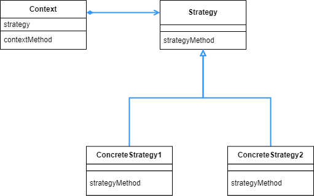

## Strategy 패턴

- 전략이라는 뜻으로, 프로그래밍 쪽에서는 알고리즘과 유사한 의미로 사용된다. 하나의 문제를 여러가지 전략, 즉 알고리즘으로 전환해서 해결하려는 패턴이다.

<br>

<div align="center">
 
</div>

<br>

이번 예시는 가위바위보로, 두가지 각기 다른 전략으로 하나의 문제를 시도하는 것을 구현한다.

<br>

```java
public enum Hand {
    ROCK("바위", 0),
    SCISSORS("가위", 1),
    PAPER("보", 2);

    private String name;
    private int handvalue;

    private static Hand[] hands = {
        ROCK, SCISSORS, PAPER
    };

    private Hand(String name, int handvalue) {
        this.name = name;
        this.handvalue = handvalue;
    }

    public static Hand getHand(int handvalue) {
        return hands[handvalue];
    }

    public boolean isStrongerThan(Hand h) {
        return fight(h) == 1;
    }

    public boolean isWeakerThan(Hand h) {
        return fight(h) == -1;
    }

    private int fight(Hand h) {
        if (this == h) {
            return 0;
        } else if ((this.handvalue + 1) % 3 == h.handvalue) {
            return 1;
        } else {
            return -1;
        }
    }

    @Override
    public String toString() {
        return name;
    }
}
```

<br>

우선 Enum 타입으로 손을 나타내는 Hand 클래스를 작성했다. 이 부분은 Strategy 에 포함되는 부분은 아니다. 그저 어떤 하나의 문제 상황을 만들기 위해서 이용하는 클래스이다.

getHand 메소드의 경우 Hand 타입의 인스턴스를 가지고 오는 데다가 앞에 static이 붙어 있으므로, 정적 펙토리 메소드라고 볼 수 있다. 그리고 Enum 타입의 특성상 해당 인스턴스들은 대응하는 값(0,1 ,2) 에 해당하는 인스턴스만 반환이 되므로, 싱글톤 패턴이 사용되었음을 알 수 있다.

fight 메소드의 this.handvalue == h.handvalue 가 아니라 this == h 라고 써도 괜찮은 이유 또한 싱글톤이 보장되는 Enum 타입에서 쓰였기 때문이다. 굳이 필드값까지 비교하지 않더라도, 인스턴스가 딱 3개만 있기 때문에 객체만 가지고 같은 주소를 참조하는지 아닌지 바로 사용할 수 있는 것이다.

<br>

```java
public interface Strategy {
    public abstract Hand nextHand();
    public abstract void study(boolean win);
}
```

<br>

전략 인터페이스 이다. 이 부분을 구체화 하는 여러가지 구체 전략 클래스들이 하나의 문제를 풀게 된다.

<br>

```java
public class WinningStrategy implements Strategy {
    private Random random;
    private boolean won = false;
    private Hand prevHand;

    public WinningStrategy(int seed) {
        random = new Random(seed);
    }

    @Override
    public Hand nextHand() {
        if (!won) {
            prevHand = Hand.getHand(random.nextInt(3));
        }
        return prevHand;
    }

    @Override
    public void study(boolean win) {
        won = win;
    }
}
```

<br>

이 전략은 이전 승부에서 이겼다면 같은 손을, 졌다면 난수를 통해서 다음 손을 결정한다.

<br>

```java
public class ProbStrategy implements Strategy {
    private Random random;
    private  int prevHandValue;
    private int currentHandValue;
    private int[][] history = {
        {1, 1, 1},
        {1, 1, 1},
        {1, 1, 1}
    };

    public ProbStrategy(int seed) {
        random = new Random(seed);
    }

    @Override
    public Hand nextHand() {
        int bet = random.nextInt(getSum(currentHandValue));
        int handValue = 0;
        if (bet < history[currentHandValue][0]) {
            handValue = 0;
        } else if (bet < history[currentHandValue][0] + history[currentHandValue][1]) {
            handValue = 1;
        } else {
            handValue = 2;
        }
        prevHandValue = currentHandValue;
        currentHandValue = handValue;
        return Hand.getHand(handValue);
    }

    private int getSum(int handvalue) {
        int sum = 0;
        for (int i = 0; i < 3; i++) {
            sum += history[handvalue][i];
        }
        return sum;
    }

    @Override
    public void study(boolean win) {
        if (win) {
            history[prevHandValue][currentHandValue]++;
        } else {
            history[prevHandValue][(currentHandValue + 1) % 3]++;
            history[prevHandValue][(currentHandValue + 2) % 3]++;
        }
    }
}
```

<br>

이 전략은 직전에 낸 손과 이번에 낼 손에 대한 승부 결과를 history 에 저장해서, 이긴적이 많았던 손을 낼 확률을 높인다. 이 전략은 상대방이 내는 손의 패턴이 일정하다고 가정했을 때 유효한 전략이다.

<br>

```java
public class Player {
    private String name;
    private Strategy strategy;
    private int wincount;
    private int losecount;
    private int gamecount;

    public Player(String name, Strategy strategy) {
        this.name = name;
        this.strategy = strategy;
    }

    public Hand nextHand() {
        return strategy.nextHand();
    }

    public void win() {
        strategy.study(true);
        wincount++;
        gamecount++;
    }

    public void lose() {
        strategy.study(false);
        losecount++;
        gamecount++;
    }

    public void even() {
        gamecount++;
    }

    @Override
    public String toString() {
        return "["
            + name + ":"
            + gamecount + " games, "
            + wincount + " win, "
            + losecount + " lose "
            + "]";
    }
}
```

<br>

승부 결과를 저장할 Player 클래스이다. 전략을 사용하는 주체가 된다.

<br>

```java
public class Main {

    public static void main(String[] args) {
        if (args.length != 2) {
            System.out.println("Usage: java Main randomseed1 randomseed2");
            System.out.println("Example: java Main 314 15");
            System.exit(0);
        }

        int seed1 = Integer.parseInt(args[0]);
        int seed2 = Integer.parseInt(args[1]);
        Player player1 = new Player("KIM", new WinningStrategy(seed1));
        Player player2 = new Player("Lee", new ProbStrategy(seed2));
        for (int i = 0; i < 10000; i++) {
            Hand nextHand1 = player1.nextHand();
            Hand nextHand2 = player2.nextHand();
            if (nextHand1.isStrongerThan(nextHand2)) {
                System.out.println("Winner:" + player1);
                player1.win();
                player2.lose();
            } else if (nextHand2.isStrongerThan(nextHand1)) {
                System.out.println("Winner:" + player2);
                player2.win();
                player1.lose();
            } else {
                System.out.println("Even...");
                player1.even();
                player2.even();
            }
        }
        System.out.println("Total Result");
        System.out.println(player1);
        System.out.println(player2);
    }
}
========================================================================
.... (생략)
Winner:[KIM:9995 games, 3166 win, 3489 lose ]
Winner:[Lee:9996 games, 3489 win, 3167 lose ]
Even...
Even...
Even...
Total Result
[KIM:10000 games, 3167 win, 3490 lose ]
[Lee:10000 games, 3490 win, 3167 lose ]
```

각각의 전략을 사용한 Player 의 승부 결과를 볼 수 있다.

<br>

<div align="center">
 
</div>

<br>

그냥 예시만 보면 이게 어디에 도움이 되는건지 알기 힘들다. 하지만 약간 생각을 바꿔서 어떤 연산 과정에 대해서 2가지의 알고리즘을 비교하고 싶은 경우, Strategy 패턴을 사용하면 비교하기 용이하다. 예를 들어 속도는 느리지만 메모리를 절약하는 알고리즘이 있고, 속드는 빠르지만 메모리를 더 쓰는 알고리즘이 있다면, 두개를 한번에 실행해서 비교해볼 수 있다.

그리고 앞서 보았듯이 Player 가 Strategy 를 상속받지 않고, 위임의 형태로 메소드를 호출한다. 따라서 전략이나 알고리즘 전환에 제약이 거의 없다.

<br>

```java
List<String> list = Arrays.asList("D", "B", "C", "E", "A");

list.sort(new Comparator<String>() {
		public int compare(String a, String b) {
				return a.compareTo(b);
		}
});

list.sort(new Comparator<String>() {
		public int compare(String a, String b) {
				return b.compareTo(a);
		}
});
==============================================================
list.sort((a,b) -> a.compareTo(b)); // 사전순
list.sort((a,b) -> b.compareTo(a)); // 사전 역순
```

<br>

이렇게 어떤 list 를 Comparator 인터페이스를 구체화 하는 두가지 정렬 방법을 사용하는 것도 전략패턴이라고 볼 수 있다. 하나의 인터페이스를 구체화 해서, 정렬이라는 하나의 문제에 2가지 방법을 제시했다. (물론 더 많은 가지수의 전략을 취해도 상관없다.) 이런식으로 하나의 문제에 대해서 여러가지 방법을 적용해보고 비교해볼 수 있는 패턴이 Strategy 패턴이다.