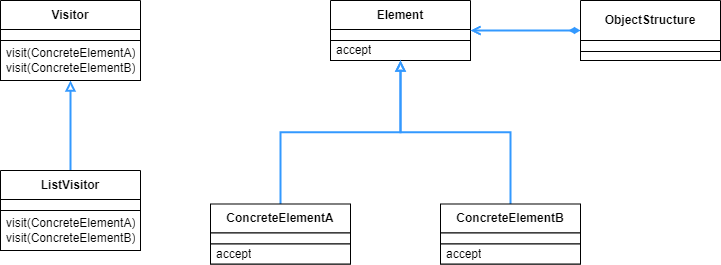

## Visitor 패턴

- 데이터 구조 안에 많은 요소가 저장되어있는 경우, 각 요소에 대한 처리의 종류가 여러가지일 때 사용하는 패턴이다. 데이터 구조와 처리를 분리하는데, 방문자가 데이터 구조를 돌아다니면서 처리를 담당하는 것으로 분리한다.

<br>

<div align="center">
 
</div>

<br>

이번 예시는 Composite 패턴의 디렉토리 구조와 같다. 하지만 데이터 구조와 처리를 분리하기 위해서, 클래스 다이어그램 좌측의 ListVisitor 를 사용한다. ListVisitor 는 Visitor 의 구현 클래스로, 방문자가 어떻게 처리할지 구체적인 동작을 나타내는 클래스라고 보면 된다.

<br>

```java
public abstract class Visitor {
    public abstract void visit(File file);
    public abstract void visit(Directory directory);
}
```

<br>

우선 방문자를 작성한다. visit 메소드는 각 데이터 구조에 방문할 때 사용할 메소드이다.

<br>

```java
public interface Element {
    public abstract void accept(Visitor v);
}
```

<br>

데이터 구조를 의미하는 인터페이스로, 방문자가 방문했을 때 받아주는 메소드인 accept 를 선언했다.

<br>

```java
public abstract class Entry implements Element {
    public abstract String getName();
    public abstract int getSize();

    @Override
    public String toString() {
        return getName() + "(" + getSize() + ")";
    }
}
```

<br>

디렉토리 구조를 만들기 위해서 만든 추상 클래스로, 데이터 구조 인터페이스를 구체화 하기 보다는 Entry 의 하위 클래스들에게 구체화를 넘기는 징검다리 역할을 한다고 보면 된다.

<br>

```java
public class File extends Entry {
    private String name;
    private int size;

    public File(String name, int size) {
        this.name = name;
        this.size = size;
    }

    @Override
    public void accept(Visitor v) {
        v.visit(this);
    }

    @Override
    public String getName() {
        return name;
    }

    @Override
    public int getSize() {
        return size;
    }
}
```

<br>

Entry 를 상속받은 하위클래스 중 하나이다. 방문자가 이 클래스에 방문했을 때 받아주는 accept 메소드가 구체화 되어있다. accept 메소드를 보면 visit 메소드를 사용하는 것을 볼 수 있는데, 결국 방문자가 오면 visit 메소드를 통해서 데이터를 처리한다.

v.visit(this) 에서 this 가 쓰였는데, 이로써 방문자가 방문했을 때 this 를 파라미터로 받으므로 결국 File 클래스에 방문했다는 것을 알 수 있다.

<br>

```java
public class Directory extends Entry implements Iterable<Entry> {
    private String name;
    private List<Entry> directory = new ArrayList<>();

    public Directory(String name) {
        this.name = name;
    }

    public Entry add(Entry entry) {
        directory.add(entry);
        return this;
    }

    @Override
    public Iterator<Entry> iterator() {
        return directory.iterator();
    }

    @Override
    public void accept(Visitor v) {
        v.visit(this);
    }

    @Override
    public String getName() {
        return name;
    }

    @Override
    public int getSize() {
        int size = 0;
        for (Entry entry : directory) {
            size += entry.getSize();
        }
        return size;
    }
}
```

<br>

디렉토리의 재귀 구조를 만들어주는 directory 클래스이다. 우선 File 클래스처럼 방문자가 방문했을 때 받아주는 accept 메소드가 구현되어있고, 그 내용또한 같다.

디렉토리의 재귀 구조를 만들기 위해서 Iterable<Entry> 인터페이스를 구체화 하고 있다. 그래야 향상된 for문을 사용해서 클래스 인스턴스를 반복 접근 할 수 있다.

<br>

```java
public class ListVisitor extends Visitor {
    private String currentdir = "";

    @Override
    public void visit(File file) {
        System.out.println(currentdir + "/" + file);
    }

    @Override
    public void visit(Directory directory) {
        System.out.println(currentdir + "/" + directory);
        String savedir = currentdir;
        currentdir = currentdir + "/" + directory.getName();
        for (Entry entry : directory) {
            entry.accept(this);
        }
        currentdir = savedir;
    }
}
```

<br>

방문자가 처리를 어떻게 할건지 구체화하는 부분이다. 처리에 해당하는 visit 메소드에서는 우선 반복하면서 accept 메소드를 호출하는 것을 볼 수 있다. 즉 방문자가 하나하나의 디렉토리를 방문하면서 필요한 처리를 하는 것을 볼 수 있다.

이번 예시에서는 현재 디렉토리와 다음 디렉토리 혹은 파일 명을 출력하는 것으로 데이터 처리를 하고 있다.

<br>

```java
public class Main {
    public static void main(String[] args) {
        System.out.println("Making root entries...");
        Directory rootdir = new Directory("root");
        Directory bindir = new Directory("bin");
        Directory tmpdir = new Directory("tmp");
        Directory usrdir = new Directory("usr");

        rootdir.add(bindir);
        rootdir.add(tmpdir);
        rootdir.add(usrdir);

        bindir.add(new File("vi", 10000));
        bindir.add(new File("latex", 20000));

        rootdir.accept(new ListVisitor());
        System.out.println();

        System.out.println("Making user entries...");
        Directory kim = new Directory("kim");
        Directory lee = new Directory("lee");
        Directory park = new Directory("park");

        usrdir.add(kim);
        usrdir.add(lee);
        usrdir.add(park);

        kim.add(new File("diary.html", 100));
        kim.add(new File("Visitor.java", 100));
        lee.add(new File("memo.tex", 100));
        park.add(new File("game.doc", 100));
        park.add(new File("junk.mail", 100));

        rootdir.accept(new ListVisitor());
    }
} 
==========================================================
Making root entries...
/root(30000)
/root/bin(30000)
/root/bin/vi(10000)
/root/bin/latex(20000)
/root/tmp(0)
/root/usr(0)

Making user entries...
/root(30500)
/root/bin(30000)
/root/bin/vi(10000)
/root/bin/latex(20000)
/root/tmp(0)
/root/usr(500)
/root/usr/kim(200)
/root/usr/kim/diary.html(100)
/root/usr/kim/Visitor.java(100)
/root/usr/lee(100)
/root/usr/lee/memo.tex(100)
/root/usr/park(200)
/root/usr/park/game.doc(100)
/root/usr/park/junk.mail(100)
```

<br>

Main 클래스의 내용은 accept 메소드가 사용되는 부분을 제외하면 Composite 패턴의 Main 클래스와 같다. 다만 Visitor 패턴의 경우 방문자가 데이터 구조를 방문하면서 처리를 따로 하고, Composite 패턴의 경우에는 데이터 구조속에 처리하는 메소드가 포함되어있었다.

<br>

<div align="center">
 
</div>

<br>

하나의 디렉토리에 두개의 파일이 있는 경우 시퀀스 다이어그램을 통해서 동작 패턴을 살펴보면, 우선 Main 함수에서 ListVisitor 인스턴스를 만든다. 그다음 Directory 클래스의 인스턴스에 대해서 accept 메소드를 호출한다. 그 다음에는 Main 함수에서 별도로 메소드를 호출 하지 않았음에도, 방문자가 디렉토리와 파일을 알아서 방문하면서 데이터 처리를 하는 것을 볼 수 있다.

accept 메소드와 visit 메소드는 정확히 반대 관계에 있는 메소드로, 일반적으로 이런 관계를 더블 디스패치(Double Dispatch) 라고 부른다.

<br>

<div align="center">
 
</div>

<br>

accept 메소드는 데이터 구조 부분에서 모두 필요하다. 방문자가 모두 방문을 해야하기 때문이다. 이런 점 때문에  Visitor 의 하위클래스에 해당하는 새로운 처리 방법의 추가는 쉽다. 하지만 데이터 구조쪽의 하위 클래스 추가는 쉽지 않다. 만약 데이터 구조 쪽에 새로운 구체요소가 추가되면, Visitor 의 하위 클래스에 각각 추가된 요소에 대한 처리를 추가해야한다.

그냥 데이터 구조에서 처리하면 될 것을 이렇게 번거로운 작업을 통해서 데이터 구조와 처리를 분리하는 이유는 개발에서 기능의 확장과 수정에 많은 중점을 두기 때문이다. 변경에는 닫혀있으면서 확장에는 열려있는 OCP 를 만족하는 구조를 만드는 것이 좋다. 왜냐하면 무언가 기능을 추가할 때 기존의 코드를 모두 수정해야한다면 꽤나 번거롭고, 또 다른 문제가 발생할 여지가 높다. 하지만 만약 새로운 기능이나 요소를 추가하더라도 기존의 코드에 변경이 필요가 없다면, 기능 추가가 번거롭지 않고 문제가 발생하더라 하더라도 새로 추가한 부분만 보면 된다. 객체 지향 프로그래밍에서 항상 지키려고 노력해야하는 원칙 중 하나이다.